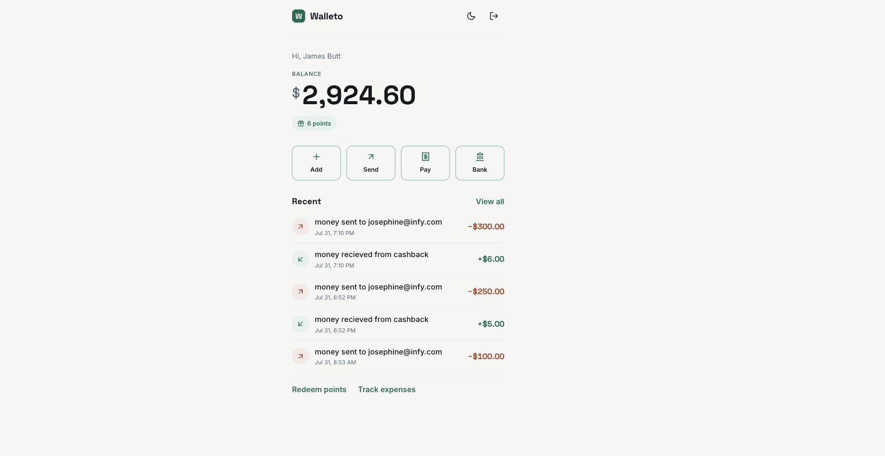
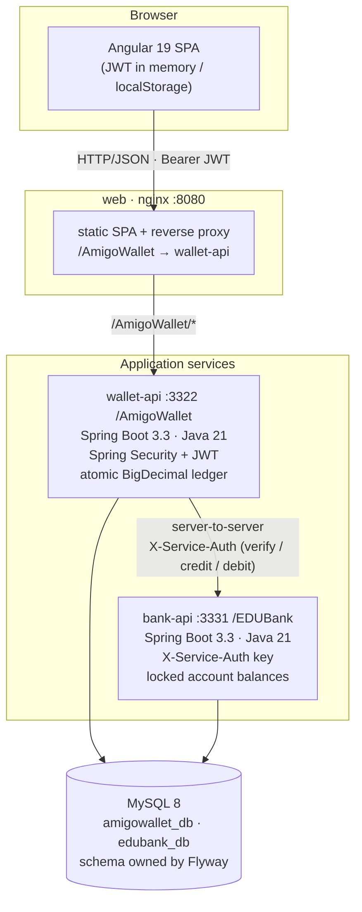
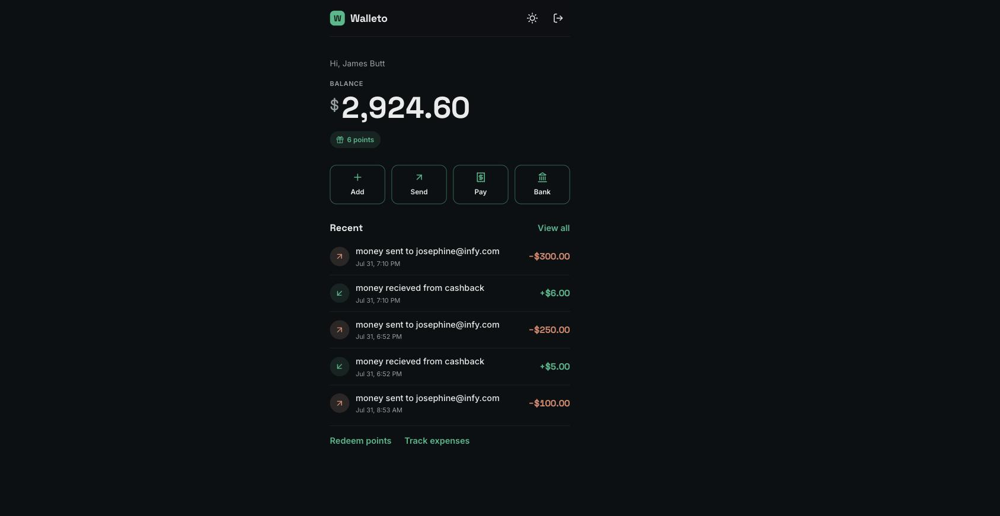

# Walleto

**A full-stack digital wallet** — send money, load funds from a linked bank, pay bills, earn rewards, and view your transaction history. Angular single-page app backed by two Spring Boot services and MySQL, shipped as a health-gated Docker Compose stack.

[](https://github.com/JayeshSuryavanshi/Walleto/actions/workflows/ci.yml)
[](LICENSE)


> **Originally built in 2021** as a training-era full-stack project (Angular 7 · Spring Boot 2.1 · JSP).
> **Modernized in 2026** to a production-grade, containerized application: Spring Boot 3.3 / Java 21,
> Angular 19, real JWT authentication, atomic money movement, a consolidated bank service, and a
> one-command Docker Compose deployment. The 2021 history is preserved; the modernization is honest,
> present-dated work — see the commit log.



---

## Quickstart

**Prerequisites:** Docker + Docker Compose.

```bash
git clone https://github.com/JayeshSuryavanshi/Walleto.git
cd Walleto
cp .env.example .env          # dev defaults are fine to start
docker compose up --build     # add -d to run detached
```

Then open **http://localhost:8080**.

The stack comes up health-gated (MySQL → APIs → web) and seeds demo data automatically via Flyway.

### Demo credentials

| Use | Value |
|---|---|
| **Wallet login** | `james@example.com` / `James#123` |
| Load money — net banking | login `martin` / `Martin!123` |
| Load money — debit card | number `6642110005012149`, PIN `1234`, expiry `2030-12-31` |
| Transfer to bank | account `443328602688019`, IFSC `EDUB0000501`, holder `Martin Luther` |
| Send money to another wallet | recipient `josephine@example.com` |

> Demo users follow the pattern `<firstname>@example.com` / `<Firstname>#123` (passwords must be ≥ 8 chars).
> All seed passwords are hashed; on first login a legacy hash is transparently upgraded to BCrypt.

API docs (Swagger UI): **http://localhost:3322/AmigoWallet/swagger-ui.html**

---

## Architecture

The browser talks **only** to nginx (same-origin, no CORS). nginx serves the SPA and reverse-proxies the
wallet API. The wallet service owns all money movement and calls the bank service **server-to-server**
inside a transaction — the browser never touches the bank directly.



### Components

| Component | Directory | Stack | Port · Context |
|---|---|---|---|
| **web** | `amigowalletfrontend/` | Angular 19 (standalone) · nginx | `8080` |
| **wallet-api** | `amigowalletbackend/` | Spring Boot 3.3.5 · Java 21 · Spring Security · JPA · Flyway | `3322` · `/AmigoWallet` |
| **bank-api** | `edubank/` | Spring Boot 3.3.5 · Java 21 · Spring Security · JPA · Flyway | `3331` · `/EDUBank` |
| **mysql** | — | MySQL 8.0 | `3306` |

---

## Features

- **Accounts** — registration with a security question, JWT login, change-password, and forgot-password (security-question → single-use reset token).
- **Wallet** — dashboard with live balance & reward points, wallet-to-wallet transfers by email (with cashback + points), bill payments to merchants, and reward-point redemption.
- **Bank integration** — load money from a linked bank via debit card or net banking, and withdraw to a bank account. Every bank leg is orchestrated server-side.
- **History** — full, filterable transaction history.



---

## Security & correctness

This is a money app, so the modernization focused on getting the fundamentals right:

- **Authentication** — stateless JWT (HS256) with a Spring Security filter chain; every wallet / transaction / card endpoint requires a valid token. Identity is derived from the JWT, never from a client-supplied `userId` (no IDOR).
- **Passwords** — BCrypt (strength 12) via `DelegatingPasswordEncoder`, with transparent upgrade of legacy hashes on login. CVV is never stored; card numbers are masked to last-4 in responses.
- **Account recovery** — reset requires passing security-question verification, which mints a short-lived, single-purpose reset token; the reset endpoint consumes that token (closing the original unauthenticated-reset takeover).
- **Money integrity** — balances are `BigDecimal` (`DECIMAL`), stored authoritatively and updated **atomically** with the ledger inside `@Transactional(rollbackFor = Exception.class)`. Debits are guarded by sufficient-funds and positive-amount checks under a row lock (`PESSIMISTIC_WRITE` + `@Version`) with bounded retry on contention — verified double-spend-safe under concurrent load.
- **Service-to-service** — the wallet calls the bank with a shared service key (`X-Service-Auth`); the bank API is not reachable from the browser.
- **Configuration** — all secrets and connection details are environment variables (see `.env.example`); no credentials in source.

---

## Development

Each service is independently buildable. Docker is the supported path (hermetic, matches CI); you can also run natively with JDK 21 / Node 20 against your own MySQL.

```bash
# backends (from amigowalletbackend/ or edubank/) — needs MySQL + env, or just use compose
./mvnw spring-boot:run

# frontend (from amigowalletfrontend/)
npm install && npx ng serve     # dev server on :4200
```

### Tests & CI

```bash
# from amigowalletbackend/ or edubank/
mvn verify                      # unit + web-slice tests
```

GitHub Actions (`.github/workflows/ci.yml`) builds and tests both services, builds the frontend, and builds all Docker images on every push / PR.

---

## Project structure

```
Walleto/
├── amigowalletfrontend/   # Angular 19 SPA (standalone) + nginx Dockerfile
├── amigowalletbackend/    # wallet-api — Spring Boot 3.3 / Java 21
├── edubank/               # bank-api — Spring Boot 3.3 / Java 21 (REST only)
├── ops/db/init/           # MySQL bootstrap (creates both databases)
├── docs/BLUEPRINT.md      # the modernization blueprint (deep code map)
├── docker-compose.yml     # full stack: mysql + wallet-api + bank-api + web
└── .github/workflows/     # CI
```

## License

[MIT](LICENSE)
