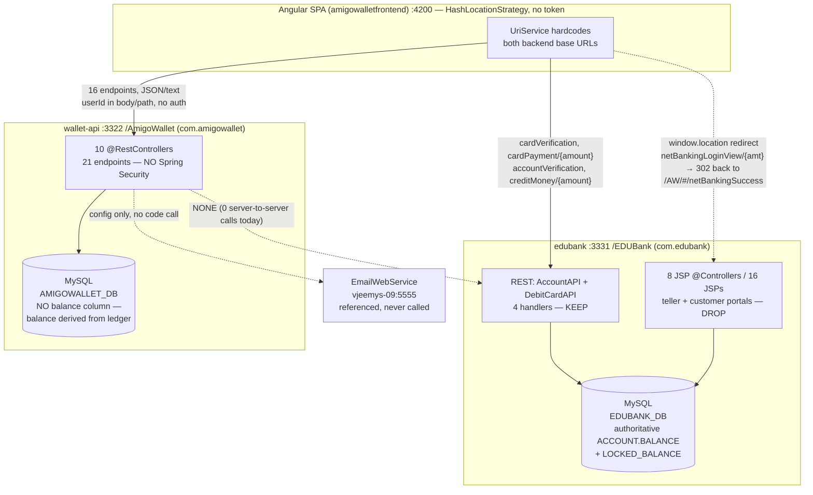

# Walleto Modernization Blueprint

> **Single source of truth** for modernizing Walleto (a 2021 Angular 7 + Spring Boot 2.1 e-wallet) to
> **Spring Boot 3.3 / Java 21 + Angular latest**, with **Spring Security + JWT + BCrypt**, **atomic money
> operations**, a consolidated lean **`bank-api`** (edubank with JSP removed), and **Docker Compose**.
>
> Derived from a 9-agent deep code-map. Every path, port, property key, endpoint spelling (including the
> misspelled `BankTrasnferAPI` mapping), and version number below is taken verbatim from the source and must
> be preserved unless a migration note explicitly changes it. `[INFERENCE]` marks the few places where a
> target-design recommendation goes beyond what the code states.

---

## System Overview

Three independently-built components in one monorepo at `/Users/jayeshsuryavanshi/github-updates/Walleto`
(no aggregator POM, no Dockerfiles, no `docker-compose`, no CI today):

| Component | Module dir | Stack (today) | Port | Context-path | Database |
|---|---|---|---|---|---|
| **wallet-api** ("AmigoWallet") | `amigowalletbackend/` | Spring Boot **2.1.0.RELEASE**, Java **1.8**, jar, `com.infy:AmigoWallet` | **3322** | **`/AmigoWallet`** | MySQL `AMIGOWALLET_DB` |
| **bank-api** (edubank) | `edubank/` | Spring Boot **2.1.0.RELEASE**, Java **1.8**, jar + **JSP/JSTL/Jasper**, `com.infy:EDUBank` | **3331** | **`/EDUBank`** | MySQL `EDUBANK_DB` |
| **web** (AmigoWalletUI) | `amigowalletfrontend/` | Angular **7.2.0**, CLI 7.2.1, TS 3.2.2, RxJS 6.3.3, HashLocationStrategy | **4200** (dev) | `/` (`dist/AmigoWalletUI`) | — |

**How they interact today (the critical architecture finding):**

- The **Angular browser** is the only orchestrator. It calls **wallet-api** for all wallet operations
  **and calls edubank directly from the browser** for the bank legs of money movement.
- **The wallet backend makes ZERO server-to-server calls into edubank.** Exhaustive grep of
  `amigowalletbackend/src` for `RestTemplate`, `WebClient`, `HttpURLConnection`, `openConnection`, `okhttp`,
  `feign`, `java.net.http`, `URL(` returned **no matches**. The wallet's "bank transfer" / "load money"
  endpoints only write the wallet's own ledger — they never contact edubank.
- Both backend base URLs are **hardcoded** in `amigowalletfrontend/src/app/shared/uri.service.ts`
  (`http://localhost:3322/AmigoWallet` and `http://localhost:3331/EDUBank`);
  `environment.ts`/`environment.prod.ts` only carry `{ production }`.
- wallet-api's service layer also references an external **EmailWebService** at `http://vjeemys-09:5555/EmailWebService/sendMail`
  (a decommissioned lab host) and a reset-password deep link `http://localhost:4200/#/resetPassword/<token>`
  (config keys `EmailWebServiceURL`, `ResetPasswordURL` in `configuration.properties`) — but no OTP/email is
  actually sent in code.



**Target topology (see `## Target Docker Compose Topology`):** the browser talks **only** to nginx
(relative `/AmigoWallet` and `/EDUBank` paths); nginx reverse-proxies to `wallet-api` and `bank-api` by
Docker service name; and **wallet-api calls bank-api server-to-server** inside a transactional boundary.
This single inversion fixes the auth, CORS, and money-integrity problems at once.

---

## wallet-api

Spring Boot MVC REST layer for the "AmigoWallet" e-wallet. Boot entrypoint `AmigoWalletApplication`
(`@SpringBootApplication` + `@PropertySource("classpath:messages.properties")`). `application.properties`
sets `server.port=3322`, `server.servlet.context-path=/AmigoWallet`, datasource
`jdbc:mysql://localhost:3306/AMIGOWALLET_DB` (`root` / empty password), `ddl-auto=none`,
`spring.jpa.show-sql=true`, whitelabel error page disabled. Ten `@RestController` classes; every full path
is `http://localhost:3322/AmigoWallet/<ControllerMapping>/<method>`.

**Uniform style:** controllers `@Autowired` an `Environment` + a service; success/error strings resolved via
`environment.getProperty(key)` where the key is either a literal or **the exception message itself**
(`environment.getProperty(e.getMessage())` — NPE→500 when the message is null/unmapped). Errors re-thrown as
`org.springframework.web.server.ResponseStatusException`. Static **Log4j2** (`LogManager`) loggers. Every
controller has a bare `@CrossOrigin` (effectively `Access-Control-Allow-Origin: *`). The controller imports
are already Spring-native (`org.springframework.web.bind.annotation.*`) with **no `javax.*`**, so they
compile against Spring 6 as-is.

### Endpoints (all 21 — full contract)

Full path prefix for every row: `http://localhost:3322/AmigoWallet`.

| Method | Path | Purpose | Auth? | Request | Response | Source file |
|---|---|---|:--:|---|---|---|
| POST | `/RegistrationAPI/validateForRegistration` | Step 1 registration: regex-validate + email/mobile uniqueness, claims OTP email (not implemented) | No | `@RequestBody User` (name, emailId, mobileNumber, password, securityQuestion, securityAnswer) | 202 User + successMessage; 406 if msg contains `Validator` else 409 | `api/RegistrationAPI.java` |
| GET | `/RegistrationAPI/getAllQuestions` | List security questions for form | No | none | 200 `List<SecurityQuestion>` | `api/RegistrationAPI.java` |
| POST | `/RegistrationAPI/register` | Step 2: re-validate, SHA-256-hash password, persist `UserEntity` ACTIVE | No | `@RequestBody User` (+ OTP fields) | 201 `"Successfully registered with registration id : <id>"`; 406/409 | `api/RegistrationAPI.java` |
| POST | `/UserLoginAPI/authenticate` | Login; returns **full** User (cards w/ full PAN, transactions, balance, points) | No | `@RequestBody User` (emailId, password) | 200 full User (**password field serialized — no `@JsonIgnore`**); 401 | `api/UserLoginAPI.java` |
| POST | `/UserLoginAPI/getUser` | Re-fetch full profile by userId (client state refresh; polled every 20s) | Yes* | `@RequestBody User` (userId only) | 200 full User; 400 | `api/UserLoginAPI.java` |
| POST | `/UserLoginAPI/customerChangePassword` | Change password (old+new+confirm) | Yes* | `@RequestBody User` (userId, password, newPassword, confirmNewPassword) | 200 `"Password Successfully changed"`; 400. Mapping `{"/customerChangePassword"}` (leading slash) | `api/UserLoginAPI.java` |
| POST | `/WalletToWalletAPI/transfertowallet` | Wallet→wallet transfer by recipient email (+2% cashback, random points) | Yes* | **`@RequestBody Object[] data` = `[userId:Integer, amount:Number, emailIdToTransfer:String]`** — untyped positional array, blind-cast | 200 `"Transaction is successful."`; **404 NOT_FOUND for ALL failures** | `api/WalletToWalletAPI.java` |
| GET | `/WalletToMerchantTransferAPI/serviceType` | List merchant service types (electricity, water…) | Yes* | none | 200 `List<String>` | `api/WalletToMerchantTransferAPI.java` |
| POST | `/WalletToMerchantTransferAPI/merchantType` | List merchants for a service type | Yes* | `@RequestBody String name` (service type) | 200 `List<String>` | `api/WalletToMerchantTransferAPI.java` |
| POST | `/WalletToMerchantTransferAPI/payBill/{amount:.+}/{userId}` | Pay a merchant bill; returns points earned | Yes* | `@PathVariable amount:Double`, `@PathVariable userId:Integer`, `@RequestBody String name` | 200 `"Transaction is successful and you earned <n> points."`; 400 all failures | `api/WalletToMerchantTransferAPI.java` |
| POST | `/BankTrasnferAPI/sendMoneyBankAccount/{amount:.+}` | Withdraw wallet→bank (ledger row only) | Yes* | `@RequestBody User` (userId), `@PathVariable amount:Double` | 202 `UserTransaction`. **NO try/catch → 500 on any error.** Mapping literally misspelled `BankTrasnferAPI`; logger wrongly `DebitCardAPI.class` | `api/BankTransferAPI.java` |
| POST | `/DebitCardAPI/deleteCard` | Delete saved card by id | Yes* | `@RequestBody String cardId` | 200 Card + msg. **NO try/catch**; `Integer.parseInt(cardId)` → NumberFormatException 500; no ownership check | `api/DebitCardAPI.java` |
| POST | `/DebitCardAPI/addCard/{userId}` | Add debit card to a user | Yes* | `@RequestBody Card` (number, cvv, expiry, name, bank), `@PathVariable userId:Integer` | 201 Card + msg; 409 | `api/DebitCardAPI.java` |
| GET | `/DebitCardAPI/fetchBankDetails` | List all banks (card/account forms) | Yes* | none | 200 `List<Bank>` | `api/DebitCardAPI.java` |
| POST | `/DebitCardAPI/loadMoneyDebitCard/{amount:.+}` | Load wallet from debit card | Yes* | `@RequestBody User` (userId), `@PathVariable amount:Double` | 202 `UserTransaction`. **NO try/catch → 500** | `api/DebitCardAPI.java` |
| POST | `/NetBankingAPI/loadMoneyNetBanking` | Load wallet via net banking | Yes* | `@RequestBody User` — **amount taken from `user.getBalance()`** (client-controlled), + userId | 200 `UserTransaction`. **NO try/catch → 500** | `api/NetBankingAPI.java` |
| POST | `/ForgotPasswordAPI/forgotPassword` | Start recovery: return account so client shows its security question | No | `@RequestBody String emailId` | 200 **full User** (enables enumeration + disclosure); 403 | `api/ForgotPasswordAPI.java` |
| POST | `/ForgotPasswordAPI/validateAnswer` | Validate security-question answer | No | `@RequestBody User` (userId, securityAnswer) | 202 `"Successfully validated the answer given"`; 403. **Issues no token, records no state** | `api/ForgotPasswordAPI.java` |
| POST | `/ForgotPasswordAPI/resetPassword` | Reset password at end of recovery | No | `@RequestBody User` (userId, newPassword, confirmNewPassword) | 200 `"Password is successfully re-set"`; 403. **Not gated by validateAnswer, no token → account takeover** | `api/ForgotPasswordAPI.java` |
| POST | `/RewardPointsAPI/redeemRewardPoints` | Redeem all reward points to wallet money | Yes* | `@RequestBody User` (userId) | 200 User + msg; 412 (e.g. `< 10` points) | `api/RewardPointsAPI.java` |
| POST | `/TransactionHistoryAPI/getAllTransactions` | Full transaction history | Yes* | `@RequestBody User` (userId) | 200 `List<UserTransaction>`; 404 | `api/TransactionHistoryAPI.java` |

\* **"Auth? = Yes*" is aspirational.** Today there is **no authentication anywhere** — the column marks
endpoints that *must* become authenticated (identity from JWT, not the body/path `userId`) in the target.
The frontend contract (misspelled `BankTrasnferAPI`, positional array body, path amounts) must be preserved
or versioned in lockstep with the Angular rewrite.

### Money Flows (exact steps + integrity defects)

Balance is **event-sourced**: each money movement is an INSERT of one or more `UserTransactionEntity` rows.
Debit = `PaymentTypeEntity.paymentType='D'` (`remarks="D"`); credit = `'C'`. `walletDebit`/`walletCredit` in
`WalletToWalletDAOImpl` **do not read or check any balance** — they append a row. Money is `Double` everywhere.

**Check matrix (all flows):**

| Flow | Sufficient-funds | Positive-amount (`> 0`) | Debit+credit atomic |
|---|:--:|:--:|:--:|
| Load money (card / net-banking) | N/A (credit) | ❌ none | single insert (ok) |
| Wallet→wallet | ❌ **none** | ❌ none | ❌ broken (checked-exc no rollback) |
| Wallet→merchant / bill | ✅ derived-sum (racy TOCTOU) | ❌ none | ❌ broken (checked-exc no rollback) |
| Transfer to bank | ❌ **none** | ❌ none | single insert (ok) |
| Redeem points | N/A | N/A (`≥10` pts) | ❌ racy double-redeem |

1. **Load money (debit card / net banking)** — `DebitCardAPI.loadMoneyDebitCard` reads `@RequestBody User` +
   `@PathVariable Double amount`; **`NetBankingAPI.loadMoneyNetBanking` instead uses `user.getBalance()` from
   the body as the amount** → arbitrary client-controlled credit. `UserTransactionServiceImpl` builds a credit
   `UserTransaction` and calls `UserTransactionDAOImpl.loadMoney` (line ~44): `entityManager.find(UserEntity,
   userId)` then `getUserTransactionEntities()` with **no null check (NPE 500 on bad userId)**; looks up
   `PaymentTypeEntity` (from=B,to=W,type=C) via `getSingleResult` (NoResultException if config row missing);
   persists one credit row. **No positive-amount check** → a negative amount lowers the derived balance.
2. **Wallet→wallet transfer (+2% cashback + reward points)** — `WalletToWalletAPI.transferToWallet` parses the
   `Object[]` → userId, amount, email; `WalletToWalletServiceImpl.transferToWallet` (line 27) calls the DAO and
   throws a **checked** `Exception('WalletService.TRANSACTION_FAILURE')` on `0`.
   `WalletToWalletDAOImpl.transferToWallet`: `receiver=getUserByEmailId(email)`, `sender=getUserByUserId(userId)`.
   - **Self-pay guard `if(sender==receiver)` uses reference equality on two separately-constructed objects →
     ALWAYS false → self-transfer allowed.**
   - `if(sender==null) return 0; if(receiver==null) throw INVALID_EMAIL`. **No funds check, no positive-amount check.**
   - If `amount>=200`, cashback `= amount*0.02` (uncapped, credited to the **sender**).
   - `rewardpoint = new Random().nextInt(5)` awarded to the **sender's debit row** (spending mints points).
   - `walletDebit(sender) || walletCredit(receiver)` — the `||` short-circuits: **a persisted debit + failed
     credit** returns `0`, service throws a **checked** exception, and `@Transactional` does **not** roll it
     back → debit commits without matching credit.
   - Cashback `walletCredit(sender, cashback)` return value is **ignored** (line 101).
   - **Combined exploit:** self-transfer of `amount>=200` (guard never fires, no funds check) → net ~0 to
     balance **plus** 2% cashback **plus** random points = unbounded money/points printing; then drain via
     transfer-to-bank (also no funds check).
3. **Wallet→merchant / bill payment** — `WalletToMerchantTransferAPI.payBill` (`@PathVariable userId, amount`;
   `@RequestBody` merchant name) in a try/catch that rethrows `ResponseStatusException(environment.getProperty(
   e.getMessage()))`. `BillPaymentServiceImpl.payBill` loads **ALL** user transactions via
   `rewardPointsDAO.getAllTransactionByUserId`, **re-derives balance by looping rows** (NPE if any
   `paymentType` is null), then `if(balance<amount) throw INSUFFICIENT_BALANCE` — **the only funds check in the
   codebase, but read-then-write with no lock (TOCTOU)**. **No positive-amount check** (negative passes and a
   negative debit increases balance). `billPaymentDAO`: `registerMerchantTransaction` (hardcoded
   `paymentTypeId=1`, `remarks='C'`, mislabeled `WALLET_TO_WALLET_CREDIT` + user's email) → then
   `registerUserTransaction` (random points, `walletToWalletDAO.walletDebit` for the user's debit row). Merchant
   row is written **before** the user debit; `if(res1==0 || res2==null) throw INSUFFICIENT_BALANCE` is a
   **checked** exception thrown after the merchant row persisted → merchant credited without user debit.
4. **Transfer to bank (withdraw)** — `BankTransferAPI.sendMoneyToBankAccount` (`@RequestBody User`,
   `@PathVariable amount`) — **no try/catch** — → `UserTransactionServiceImpl.sendMoneyToBankAccount` →
   `UserTransactionDAOImpl.sendMoneyToBankAccount`: `find(UserEntity)` then `getUserTransactionEntities()`
   **no null check (NPE 500)**; PaymentType from=W,to=B,type=D; persists one debit row. **No sufficient-funds
   check anywhere; no positive-amount check** → withdraw more than held (negative balance) or a negative amount
   = money printing. **No real external bank call — only a ledger row.** Most direct theft vector.
5. **Redeem reward points** — `RewardPointsAPI.redeemRewardPoints` → `RewardPointsServiceImpl.redeemRewardPoints`.
   Sums `pointsEarned` where `isRedeemed=='N'`; `if(rewardPoints < 10) throw REWARD_POINTS_NOT_ENOUGH_TO_REDEEM`
   (**comment says 100, code says 10**; constant `REDEEM_PERCENTAGE=0.10` unused, code hardcodes `/10.0`).
   `amountToBeCredited = rewardPoints/10.0`; `redeemAllRewardPoints` marks every unredeemed row `isRedeemed='Y'`;
   `addRedeemedMoneyToWallet` appends a credit row. **No lock → concurrent double-redeem.**
   `RewardPointsDAOImpl.getAllTransactionByUserId` (line 51) dereferences the txn list with no user null-check → NPE 500.

**Systemic defects:** (1) only funds check is a racy read-sum-then-insert; (2) two flows have no funds check;
(3) no flow validates `amount > 0`; (4) failure signalled by return codes + **checked** `throw new Exception`
that neither `javax.transaction.Transactional` nor Spring `@Transactional` rolls back by default → partial
writes commit; (5) self-transfer guard uses reference equality; (6) money is `Double`. **Positive finding:**
all persistence is parameterized JPQL (`createQuery`+`setParameter`) — **no SQL injection**.

### Data Model — HOW WALLET BALANCE IS STORED / DERIVED (critical)

Source of truth: `amigowalletbackend/src/main/resources/AmigoWalletMySql.sql` (DDL ~lines 1–162, then ~1,950
seed INSERTs; DB `AMIGOWALLET_DB`, **`DEFAULT CHARACTER SET latin1 COLLATE latin1_general_cs`**) + 12 JPA
entities in `com/amigowallet/entity/*.java`. Money is `FLOAT(12,2)` in SQL / `Double` in Java. **13 tables**;
a 14th (`RESET_PASSWORD`) is referenced by an entity but has **no DDL** (orphan).

> **THERE IS NO BALANCE COLUMN ANYWHERE.** `WALLET_USER` stores identity/auth only. `User.balance` and
> `User.rewardPoints` are **transient DTO fields computed in the service layer and never persisted.** Balance
> is derived **at read time** by loading ALL of a user's `USER_TRANSACTION` rows and folding them:
>
> ```
> balance = 0.0
> for each userTransaction:
>     if PAYMENT_TYPE.PAYMENT_TYPE == 'D' (debit):  balance -= AMOUNT
>     else ('C' credit):                            balance += AMOUNT
> rewardPoints = sum(POINTS_EARNED where IS_REDEEMED == 'N')
> ```
>
> This fold is **duplicated in 3 places**: `UserLoginServiceImpl.authenticate` (lines 132–163) &
> `getUserbyUserId` (lines 306–336; data-agent cites 127–162 / 299–335), and `BillPaymentServiceImpl.payBill`
> (lines 52–64). It **ignores `TRANSACTION_STATUS`**, so `PENDING`/`FAILURE` rows still move the balance.
> There is **no stored balance, no snapshot, no `@Version`, no row lock, no DB non-negative constraint** → O(n)
> reads that grow unbounded and concurrent debits that race into double-spend. This is the **opposite** of the
> bank side, where edubank `ACCOUNT` stores an authoritative `BALANCE FLOAT(12,4)` + `LOCKED_BALANCE` — the two
> money models must be reconciled during modernization.

Key tables/entities:

| Table (entity) | Notable columns | Relationships / notes |
|---|---|---|
| **`WALLET_USER`** (`UserEntity`) | `USER_ID` INT(6) PK IDENTITY; `EMAIL_ID` VARCHAR(255) UNIQUE; `MOBILE_NUMBER` VARCHAR(10) UNIQUE; `NAME`; `PASSWORD` VARCHAR(100) (**unsalted SHA-256 hex**); `USER_STATUS` (ACTIVE/INACTIVE — no LOCKED/lockedUntil/failedAttempts); `SECURITY_QUESTION_ID` BIGINT (entity maps Integer — mismatch); `SECURITY_ANSWER` VARCHAR(100) (**plaintext**); created/modified timestamps. **NO BALANCE / NO REWARD_POINTS COLUMN.** | `@ManyToOne(cascade=ALL)` securityQuestion; `@OneToMany(cascade=ALL)` cards & userTransactions via `@JoinColumn(USER_ID)`. |
| **`USER_TRANSACTION`** (`UserTransactionEntity`) — the ledger; **balance is derived from this** | `USER_TRANSACTION_ID` BIGINT PK (entity Long); `AMOUNT` FLOAT(12,2) CHECK>0 (entity **Double**); `TRANSACTION_DATE_TIME` (@CreationTimestamp); `PAYMENT_TYPE_ID` FK; `REMARKS` (holds 'C'/'D'); `INFO`; `TRANSACTION_STATUS` (SUCCESS/FAILURE/PENDING); `POINTS_EARNED` CHECK>=0; `IS_REDEEMED` CHAR(1) 'Y'/'N'; `USER_ID` FK (nullable, **not a field on the entity**). | `@ManyToOne(cascade=ALL)` paymentTypeEntity (**cascade ALL can mutate reference data**). 637 seed rows + 637 dup rows in `USER_TRANSACTION_MAPPING`. |
| **`PAYMENT_TYPE`** (`PaymentTypeEntity`) — routing dimension | `PAYMENT_TYPE_ID` INT PK (app-assigned); `PAYMENT_FROM`/`PAYMENT_TO` CHAR IN (B,M,W); `PAYMENT_TYPE` CHAR IN (D,C) — **drives the balance fold**. | 7 seed rows: 1=W→W C, 2=W→W D, 3=W→B D, 4=B→W C (load), 5=W→M C, 6=W→M D, 7=M→B D. |
| **`CARD`** (`CardEntity`) | `CARD_ID` PK IDENTITY; `CARD_NUMBER` VARCHAR(16) (**full PAN, plaintext**); `BANK_ID` FK; `EXPIRY_DATE` (LocalDate); `CARD_STATUS` (entity field misnamed `userStatus`); timestamps; `USER_ID` FK (nullable). **No CVV/PIN column** (CVV on DTO + validator only, never stored). | `@ManyToOne(cascade=ALL)` bankEntity. ~79 seed cards, all `BANK_ID=101`. |
| **`MERCHANT_TRANSACTION`** (`MerchantTransactionEntity`) | `MERCHANT_TRANSACTION_ID` BIGINT PK (entity **Integer** — mismatch); `AMOUNT` FLOAT(12,2) (Double); `PAYMENT_TYPE_ID` (raw Integer); `REMARKS`; `INFO`; `TRANSACTION_STATUS`; `MERCHANT_ID` — **`@Column(name="MERCHANT_ID ")` trailing-space bug**. | 150 seed rows; FKs modeled as raw Integers. |
| **`MERCHANT`** (`MerchantEntity`) | `MERCHANT_ID` INT PK (app-assigned); email/mobile UNIQUE; `PASSWORD` (unsalted SHA-256); status. | 22 seed merchants (1000–1021). |
| **`MERCHANT_SERVICE_TYPE`** (`MerchantServiceTypeEntity`) | `SERVICE_ID` PK AUTO_INC in schema — **entity wrongly puts `@Id` on `SERVICE_TYPE` and `@GeneratedValue` on non-@Id `SERVICE_ID`**. | 7 utility categories. |
| **`MERCHANT_SERVICE_MAPPING`** (`MerchantServiceMappingEntity`) | true M:N (35 rows) — **entity's single-column `@Id` on `MERCHANT_ID` can only load one service per merchant.** | Needs composite key / `@ManyToMany`. |
| **`AW_SECURITY_QUESTION`** (`SecurityQuestionEntity`) | `QUESTION_ID` BIGINT PK (entity Integer — mismatch); `QUESTION` UNIQUE. | 6 questions (210001–210006). |
| **`BANK`** (`BankEntity`) — cross-service link | `BANK_ID` INT PK (app-assigned); `BANK_NAME`. | Single seed row `(101,'EDU Bank')` — every card belongs to the edubank service. |
| `USER_CARD_MAPPING`, `USER_TRANSACTION_MAPPING`, `MERCHANT_TRANSACTION_MAPPING` (no entity) | Redundant join tables duplicating FK columns already on the child rows. | **No JPA entity maps them → seed-only, never maintained by the app → drift.** |
| **`RESET_PASSWORD`** (`ResetPasswordEntity`) — ORPHAN | `TOKEN_ID`, `EMAIL_ID`, `TOKEN_EXPIRY`. | `@Table` exists but **no CREATE TABLE**; forgot-password uses SECURITY_ANSWER instead → dead code. |

Seed passwords are **unsalted SHA-256** with the **plaintext printed in an adjacent SQL comment** (e.g.
`-- James#123`); `SECURITY_ANSWER` and full 16-digit `CARD_NUMBER` are **plaintext**.

### Security surface (today) + proposed target auth design

**Today:** no Spring Security on the classpath (`pom.xml` has only data-jpa, web, tomcat, test, mysql); no
filter/session/token/`@PreAuthorize`. Identity is whatever `userId`/`emailId` the client sends. `authenticate`
returns the full `User` **including the `password` field**. Passwords/security-answers via unsalted single-round
**SHA-256** (`HashingUtility`, non-constant-time hex `equals`, `getBytes()` with no charset). Registration
*claims* OTP (`INVALID_OTP`/`EXPIRED_OTP`/`OTP_NOT_FOUND` keys, `EmailWebServiceURL`) but **no OTP is generated,
sent, or verified**. Forgot-password is stateless and `resetPassword` is **not gated by validateAnswer and needs
no token** → unauthenticated account takeover. No rate limiting / lockout / CAPTCHA. Bare `@CrossOrigin`
everywhere. Plain HTTP on 3322. DB creds `root`/empty in `application.properties`.

**Proposed TARGET (Spring Boot 3.3 / Java 21):**

- **Hashing:** Spring Security `DelegatingPasswordEncoder` → **BCrypt (strength 12)**; verify legacy SHA-256
  during a transition window and transparently re-encode on successful login, then drop `HashingUtility`.
  Security answers get the same encoder (or drop KBA for email-link reset). **Never store CVV; do not persist
  raw PAN — store last-4 + a PSP vault token.**
- **Filter chain:** add `spring-boot-starter-security` + a `SecurityFilterChain` bean with
  `sessionCreationPolicy(STATELESS)`, CSRF disabled (token auth), a single tightened `CorsConfigurationSource`
  (Angular origin only — delete every per-controller `@CrossOrigin`), a login endpoint issuing a **stateless
  access JWT** (subject = userId, short TTL ~15 min), and a JWT validation filter (or
  `oauth2ResourceServer().jwt()`). Add a `@RestControllerAdvice` so raw messages/keys/stack traces never leak.
- **Public (`permitAll`):** `POST /api/auth/register` (+ security-questions lookup), `POST /api/auth/login`,
  and the recovery chain `POST /api/auth/forgot-password` → `POST /api/auth/forgot-password/verify-answer`
  (mints a **single-use, short-TTL reset token**) → `POST /api/auth/reset-password` (**consumes that token,
  never a bare userId**). Add **rate limiting + lockout + CAPTCHA** to these.
- **Authenticated (JWT required):** everything else — `GET /api/users/me` (replaces `getUser`, id from JWT,
  card PANs masked to last-4), `POST /api/users/me/password` (replaces `customerChangePassword`), and all
  wallet/transaction/card endpoints, deriving `userId` from the JWT — never from the body/path.
- Add `LOCKED` status + `lockedUntil` + `failedAttempts` to the user; per-IP/per-account rate limiting
  (Bucket4j or gateway); server-side CAPTCHA verification; HTTPS/TLS only; externalized DB creds
  (env/Docker secrets, non-root DB user); generic non-enumerating auth responses.

---

## bank-api (edubank consolidation)

`edubank` (`com.infy:EDUBank:0.0.1-SNAPSHOT`, Spring Boot **2.1.0.RELEASE**, Java **1.8**, jar with a JSP view
layer) is the simulated core-banking backend: customers, accounts, account↔customer mappings, debit cards,
tellers, branches, transactions, security questions. `server.port=3331`, `server.servlet.context-path=/EDUBank`,
`spring.mvc.view.prefix=/WEB-INF/views/`, MySQL `EDUBANK_DB` (`root`/empty), `ddl-auto=none`, logging via
`spring-boot-starter-log4j2` (`log4j2.xml`).

### REST endpoints to KEEP vs JSP controllers to DROP

**KEEP — the entire real bank contract the wallet depends on (4 handlers, secure + port them):**

| Method | Path | Purpose | Source |
|---|---|---|---|
| POST | `/EDUBank/AccountAPI/accountVerification` | Verify account by `{accountNumber, ifsc, accountHolderName}` | `api/AccountAPI.java` |
| POST | `/EDUBank/AccountAPI/creditMoney/{amount:.+}` | Credit a bank account (wallet→bank), write CREDIT ledger row | `api/AccountAPI.java` |
| POST | `/EDUBank/DebitCardAPI/cardVerification` | Verify card (number, holder, hashed CVV, expiry, status) — note magic bypass `cardHolderName=="SAVED_CARD_PAYMENT"` skips name check | `api/DebitCardAPI.java` |
| POST | `/EDUBank/DebitCardAPI/cardPayment/{amount:.+}` | Debit account via card (bank→wallet top-up): verify PIN → resolve mapping → account → debit → DEBIT row | `api/DebitCardAPI.java` |

All 4 return `ResponseEntity<String>` (plain text) and throw `ResponseStatusException(BAD_REQUEST, message)`.

**DROP — all 8 JSP `@Controller`s (server-rendered UI, HttpSession-bound), 16 JSPs, 13 static assets:**

| Controller | Routes (server-rendered) | Why dropped |
|---|---|---|
| `NetBankingController` | `/netBankingLoginView/{amt}`, `/netBankingLogin`, `/payByNetBanking`, `/netBankingPaymentCancled` | "Load money via net banking" browser-redirect flow — **re-implemented as one REST endpoint** (see below) |
| `CustomerLoginController` | `/` (customerLogin), `/authenticateCustomer`, `/customerHome`, `/logout`, `/customerChangePassword`, `/viewTransactionsDateRange`, `/Next`, `/Previous` | Customer net-banking portal UI |
| `TellerLoginController` | `/tellerLogin`, `/authenticateTeller`, `/tellerHome`, `/tellerLogout` | Teller portal |
| `RegistrationController` | `/registerCustomer`, `/download` | Teller registers customer (+ PDF) |
| `AddMoneyController` | `/customerAddMoney`, `/addMoney`, `/findAccount` | Teller adds money |
| `CustomerDetailsController` | `/customerDetails`, `/NextSetCustomers`, `/PreviousSetCustomers` | Teller customer list |
| `DebitCardController` | `/changeDebitCardPin` | Change PIN |
| `ForgotPasswordController` | `/forgotPassword`, `/forgotPasswordSecQA`, `/resetPassword`, `/resetPasswordSuccess` | Customer forgot/reset via security question |

**Recommended lean bank-api surface (Spring Boot 3.3, stateless JSON, `BigDecimal` in body, server-to-server
auth) `[INFERENCE — target design]`:**

1. `POST /api/accounts/verify` ← `AccountAPI.accountVerification` → `{verified, accountHolderName}`
2. `POST /api/accounts/credit` ← `AccountAPI.creditMoney` (amount out of the path, idempotency key) → `{bankTransactionId}`
3. `POST /api/cards/debit` ← **merges** `cardVerification` + `cardPayment` into one atomic verify-and-debit → `{bankTransactionId}`
4. `POST /api/netbanking/debit` (**NEW**) ← replaces the whole JSP net-banking flow with one stateless
   credential-checked debit (no `window.location`, no open-redirect) → `{bankTransactionId}`

Every debit/credit returns a bank-issued transaction id the wallet verifies before touching its ledger;
verify+move must be atomic. Keep the service fully stateless (no `HttpSession`, no controller instance fields).

### The exact set of endpoints the wallet calls into edubank

**All originate from the Angular browser, not the wallet backend** (wallet backend → edubank = **NONE**):

| # | edubank endpoint | Wallet flow | Frontend caller |
|---|---|---|---|
| 1 | `POST /EDUBank/AccountAPI/accountVerification` | Transfer-to-bank step 1 | `transfer-to-bank.service.ts:34` (from `.component.ts:69,99`) |
| 2 | `POST /EDUBank/AccountAPI/creditMoney/{amount}` | Transfer-to-bank step 2 (bank credited **first**) | `transfer-to-bank.service.ts:44` (from `.component.ts:106`) |
| 3 | `POST /EDUBank/DebitCardAPI/cardVerification` | Load-money (card) step 1 | `load-money.service.ts:91` (from `.component.ts:221,337`) |
| 4 | `POST /EDUBank/DebitCardAPI/cardPayment/{amount}` | Load-money (card) step 2 | `load-money.service.ts:46` (from `.component.ts:222,353`) |
| 5 | `GET /EDUBank/netBankingLoginView/{amount}?protocol=&host=&port=&requestPage=netBankingSuccess` | Load-money (net banking) — **`window.location` redirect**, 302 back to `/AW/#/netBankingSuccess/{amount}/{transactionId}` | `load-money.component.ts:308-314`; return leg `net-banking-success.component.ts` |

### edubank data model (EDUBANK_DB)

`EDUBankMySql.sql` (2231 lines: DDL + heavy seed — 1,835 `TRANSACTION` inserts, 37 debit cards, teller/customer/
branch seeds), charset **latin1/latin1_general_cs**, **zero foreign keys** (all links are loose scalar ids),
`ddl-auto=none`. Money is `Double` / `FLOAT(12,4)`.

| Table (entity) | Notable columns | Notes |
|---|---|---|
| `ACCOUNT` (`AccountEntity`) | `ACCOUNT_ID` PK IDENTITY (**`@Column("ACCOUNT_ID ")` trailing-space bug**); `accountNumber` UNIQUE VARCHAR(15); `branchId`; **`balance` Double (FLOAT(12,4))**; **`lockedBalance` Double**; `accountStatus` enum | **Authoritative stored balance** (unlike wallet). No JPA associations. |
| `CUSTOMER` (`CustomerEntity`) | `customerId` Integer @Id (SQL BIGINT — mismatch); `emailId` UNIQUE; `name`; `dateOfBirth`; `securityQuestionId`; `securityAnswer` (**plaintext**); createdBy/modifiedBy (tellerId) | 1:1 with `CUSTOMER_LOGIN`. |
| `CUSTOMER_LOGIN` (`CustomerLoginEntity`) | `customerLoginId` IDENTITY; `loginName` UNIQUE; `password` (unsalted SHA-256); `customerId`; `lockedStatus` (**`@Column("LOCKED_STATUS ")` trailing-space bug**) | **Default password derived deterministically from loginName.** |
| `DEBIT_CARD` (`DebitCardEntity`) | `debitCardId` IDENTITY; `debitCardNumber` UNIQUE VARCHAR(16); `accountCustomerMappingId`; `cvv` (SHA-256 hashed, VARCHAR(100)); validFrom/validThru; `pin` (SHA-256); locked/status enums; created/modified (getters/setters commented out) | Resolves to account+customer via mapping. |
| `TRANSACTION` (`TransactionEntity`) — ledger | `transactionId` Long @Id (SQL INT(10) — mismatch); `accountNumber`; `amount` Double (FLOAT(12,4)); `transactionDateTime`; `type` enum (CREDIT/DEBIT); `transactionMode`; `remarks`; `info`; `createdBy` (e.g. `"AmigoWallet"`) | Append-only, **not written atomically with balance**. |
| `TELLER` (`TellerEntity`) | `tellerId` @Id (seeded 101–105); `loginName` UNIQUE VARCHAR(5); `password` (unsalted SHA-256, seeded in SQL) | Bank staff. |
| `BRANCH` (`BranchEntity`) | `branchId` @Id (app default `BRANCH_ID=5123`); `ifsc` UNIQUE; branchName; branchCode | — |
| `ACCOUNT_CUSTOMER_MAPPING` (`AccountCustomerMappingEntity`) | `accountCustomerMappingId` IDENTITY; `accountNumber`; `customerId`; `mappingStatus` | Account↔Customer bridge as flat columns. |
| `EDUBANK_SECURITY_QUESTION` (`SecurityQuestionEntity`) | `questionId` @Id (SQL BIGINT, seeded 210001–210006); `question` UNIQUE | Forgot-password. |
| Enums (`model/`) | `AccountStatus`, `AccountCustomerMappingStatus`, `CustomerLoginLockedStatus`, `DebitCardLockedStatus`, `DebitCardStatus`, `TransactionType` (`@Enumerated(STRING)`) | Carry over as-is. |

edubank's only downstream dependency is MySQL (leaf service — no other outbound calls).

### Dependencies to remove / upgrade

| Dependency (today) | Location | Action |
|---|---|---|
| **`spring-boot-starter-log4j2` → log4j-core 2.11.1 (Log4Shell)** | `edubank/pom.xml` (parent 2.1.0.RELEASE + starter, lines 11-16, 99-102) | **CVE-2021-44228/-45046/-45105/-44832.** Move to Boot 3.3 default **Logback** (drop the log4j2 starter); if kept, force log4j2 **≥ 2.17.1**. Rewrite `log4j2.xml` → `logback-spring.xml`; drop trace-level root + malformed duplicate logger; strip PAN/PII log lines. wallet-api also uses Log4j2 (`LogManager`) — swap to SLF4J and fix `BankTransferAPI`'s wrong logger class. |
| **iText 5.5.13** (`com.itextpdf.text.*`) | `edubank/pom.xml:46-50`; `utility/PDFUtility.java` | **AGPLv3 (needs commercial license for closed source) + EOL.** Also writes credential PDF to hardcoded **`C:\Java\`** (breaks in Docker) with plaintext secrets. **Recommended: drop PDF generation**; else swap to **OpenPDF** (LGPL/MPL, near drop-in) or license iText 7+/9. Never persist credentials to disk. |
| **`tomcat-dbcp` 9.0.0.M20** (milestone/pre-GA) | `edubank/pom.xml:39-43`; props `spring.datasource.hikari.*` 26-28 | **Drop entirely**; use Boot-managed **HikariCP** default; remove the tomcat pool properties. |
| **JSP/JSTL/Jasper**: `javax.servlet.jsp.jstl-api` 1.2.1, `taglibs:standard` 1.1.2, `tomcat-embed-jasper` | `edubank/pom.xml:52-69`; `spring.mvc.view.prefix/suffix` in `application.properties:1-3`; `webapp/WEB-INF/views/*.jsp` | **Remove all** with the 16 JSPs, `static/*` (13 assets), and the `controller/*` package. |
| **`spring-boot-starter-data-rest`** | `edubank/pom.xml:30-32` | No Spring Data repos exist today, but the starter auto-exposes any `CrudRepository` as **unauthenticated CRUD**. **Remove** unless a curated, secured HAL API is wanted. |
| **`spring-boot-devtools`** (runtime) | `edubank/pom.xml:78-81` | Ships in the artifact — mark `<optional>true</optional>` or remove. |
| Parent 2.1.0.RELEASE + `java.version` 1.8 | `edubank/pom.xml:11-16,21`; wallet `pom.xml:15-16,22-23` | Bump parent → **3.3.x**, Java → **21** (`javax.persistence.*` → `jakarta.persistence.*` across 9 edubank / 12 wallet entities). Rebrand `com.infy` → `com.walleto`; artifacts → `wallet-api` / `bank-api`. |
| `mysql:mysql-connector-java` | both poms | Replace with **`com.mysql:mysql-connector-j`** (driver `com.mysql.cj.jdbc.Driver`). |
| `maven-surefire-plugin` 2.10 (2011); wrapper Maven 3.5.4 | poms + `.mvn/wrapper/maven-wrapper.properties` | Drop surefire pin (Boot parent manages ~3.2.x for JUnit 5); regenerate wrapper to **Maven 3.9.x**. |

---

## frontend

Angular **7.2.0** SPA (`amigowalletfrontend`), CLI 7.2.1, `@angular-devkit/build-angular` 0.12, TypeScript
**3.2.2**, RxJS **6.3.3**, zone.js **0.8.26**, core-js **2.5.4**. Bootstraps `AppModule` via
`platformBrowserDynamic().bootstrapModule` (classic NgModule). **HashLocationStrategy** (`/#/login`). Globals via
`angular.json`: font-awesome 4.7, bootstrap 4.3.1 CSS + **bootstrap.js (pulls jQuery 3.3.1)**. i18n via
`@ngx-translate/core` 11 + http-loader. Also `ngx-pagination` 3.2.1, `ng2-logger` 2.0.48 (abandoned).

### Frontend → backend API contract (MUST be preserved / versioned in lockstep)

`wallet` = `http://localhost:3322/AmigoWallet`, `bank` = `http://localhost:3331/EDUBank`.

| Frontend `.service.ts` | Method | Backend URL / path | Target | Payload |
|---|---|---|:--:|---|
| `home/login/login.service.ts` | POST | `wallet` `/UserLoginAPI/authenticate` | wallet-api | `{ emailId, password }` → full User (incl. password) |
| `shared/profile.service.ts` | POST | `wallet` `/UserLoginAPI/getUser` | wallet-api | full User (userId) → User w/ password; **polled every 20s** |
| `wallet/change-password/change-password.service.ts` | POST | `wallet` `/UserLoginAPI/customerChangePassword` | wallet-api | `{ userId, password, newPassword, confirmPassword }` → text |
| `home/register/register.service.ts` | POST | `wallet` `/RegistrationAPI/validateForRegistration` | wallet-api | register form → User |
| `home/security-question/security-question.service.ts` | GET | `wallet` `/RegistrationAPI/getAllQuestions` | wallet-api | none → `SecurityQuestion[]` |
| `home/security-question/security-question.service.ts` | POST | `wallet` `/RegistrationAPI/register` | wallet-api | `{ securityQuestion{questionId}, securityAnswer, emailId, name, password, mobileNumber }` → text |
| `home/forgot-password/forgot-password.service.ts` | POST | `wallet` `/ForgotPasswordAPI/forgotPassword` | wallet-api | emailId (raw string) → User |
| `home/forgot-password/forgot-password.service.ts` | POST | `wallet` `/ForgotPasswordAPI/validateAnswer` | wallet-api | full User (securityAnswer) → text |
| `home/forgot-password/forgot-password.service.ts` | POST | `wallet` `/ForgotPasswordAPI/resetPassword/` | wallet-api | full User (new password) → text — **note trailing slash** |
| `wallet/load-money/load-money.service.ts` | POST | `wallet` `/DebitCardAPI/loadMoneyDebitCard/{amount}` | wallet-api | path `{amount}`; body card/user → UserTransaction |
| `wallet/load-money/load-money.service.ts` | POST | `wallet` `/DebitCardAPI/deleteCard` | wallet-api | **bare cardId String** (service types it `Card`) → Card |
| `wallet/load-money/load-money.service.ts` | POST | `wallet` `/DebitCardAPI/addCard/{userId}` | wallet-api | path `{userId}`; body `Card{ cardNumber, expiryDate, cvv, pin, bank }` → Card |
| `wallet/load-money/load-money.service.ts` | GET | `wallet` `/DebitCardAPI/fetchBankDetails` | wallet-api | none → `Bank[]` (on wallet-api despite "PaymentServices" comment) |
| `wallet/load-money/load-money.service.ts` | POST | `wallet` `/NetBankingAPI/loadMoneyNetBanking` | wallet-api | user with `balance = amount` set → UserTransaction (**client sets its own credited amount**) |
| `billpayment/billpaymentservice.service.ts` | GET | `wallet` `/WalletToMerchantTransferAPI/serviceType` | wallet-api | none → `String[]` |
| `billpayment/billpaymentservice.service.ts` | POST | `wallet` `/WalletToMerchantTransferAPI/merchantType` | wallet-api | serviceType (raw String) → `String[]` |
| `billpayment/billpaymentservice.service.ts` | POST | `wallet` `/WalletToMerchantTransferAPI/payBill/{amount}/{userId}` | wallet-api | path `{amount}/{userId}`; body merchant → text |
| `wallet/transfer-to-bank-component/transfer-to-bank.service.ts` | POST | `wallet` `/BankTrasnferAPI/sendMoneyBankAccount/{amount}` | wallet-api | path `{amount}`; body full User → text (**misspelled `Trasnfer`**) |
| `wallet/wallet-to-wallet-transfer/wallet-to-wallet-transfer.service.ts` | POST | `wallet` `/WalletToWalletAPI/transfertowallet` | wallet-api | **positional array `[userId, amount, emailId]`** → text |
| `wallet/points/points.service.ts` | POST | `wallet` `/RewardPointsAPI/redeemRewardPoints` | wallet-api | `{ userId }` → User |
| `wallet/transaction-history/transaction-history.service.ts` | POST | `wallet` `/TransactionHistoryAPI/getAllTransactions` | wallet-api | full User (userId) → `UserTransaction[]` |
| `wallet/transfer-to-bank-component/transfer-to-bank.service.ts` | POST | `bank` `/AccountAPI/accountVerification` | bank-api | `{ ifsc, accountNumber, accountHolderName }`; `responseType:'text'` |
| `wallet/transfer-to-bank-component/transfer-to-bank.service.ts` | POST | `bank` `/AccountAPI/creditMoney/{amount}` | bank-api | path `{amount}`; body account details; text |
| `wallet/load-money/load-money.service.ts` | POST | `bank` `/DebitCardAPI/cardVerification` | bank-api | card form; text |
| `wallet/load-money/load-money.service.ts` | POST | `bank` `/DebitCardAPI/cardPayment/{amount}` | bank-api | path `{amount}`; card form; text |
| `wallet/load-money/load-money.component.ts` | GET (nav) | `bank` `/netBankingLoginView/{amount}?protocol&host&port&requestPage=netBankingSuccess` | bank-api | **`window.location` redirect**, not XHR |
| `home/register/register.service.ts` | GET | `assets/resources/securityQuestion.json` | *(static, DROP)* | dead/duplicate of `GET /RegistrationAPI/getAllQuestions` |

**Client-orchestrated distributed money flows (no backend transaction — the integrity holes):**
- **Load-money-by-card** (`load-money.component.ts`): bank `cardVerification` → bank `cardPayment/{amount}` →
  wallet `loadMoneyDebitCard/{amount}`, nested `.subscribe()`. If step 3 fails after step 2, **bank debited,
  wallet not credited → money lost**.
- **Transfer-to-bank** (`transfer-to-bank-component.component.ts onSubmit`): bank `accountVerification` → bank
  `creditMoney/{amount}` → wallet `sendMoneyBankAccount/{amount}`, with `profileService.subMoney(amount)`
  mutating balance **in the browser**. Bank credited **first**; if the wallet call fails, **money is created**.
- **Net-banking**: `window.location` to bank `netBankingLoginView` → 302 back to `/netBankingSuccess/{amount}/
  {transactionId}` → `net-banking-success.component` reads amount **from the URL** and POSTs
  `loadMoneyNetBanking`. **Hand-crafted `#/netBankingSuccess/1000000/123` self-credits with no real bank debit**;
  reflected `host/port/protocol` = open-redirect.

### Route / component tree

Three NgModules:
- **AppModule** (root): declares `AppComponent` (`aw-root`) + `BillpaymentComponent`; imports HomeModule,
  WalletModule, BrowserModule, ReactiveFormsModule, AppRoutingModule, HttpClientModule,
  BrowserAnimationsModule, `TranslateModule.forRoot`; provides `UriService`, `LoggerService`, `RoutingGuard`,
  `TranslateService`, `{ provide: LocationStrategy, useClass: HashLocationStrategy }`. `AppRoutingModule.forRoot`
  = `'' → redirectTo '/login'`.
- **HomeModule** (`forChild`): `login`→`HomeComponent` (wraps `<aw-login>` + `<aw-register>`),
  `security`→`SecurityQuestionComponent`, `forgotPassword`→`ForgotPasswordComponent`; declares
  `RegisterComponent`. Redundantly imports HttpClientModule + `TranslateModule.forRoot` (bug).
- **WalletModule** (`forChild`): `home`→`WalletComponent` (**guarded by `RoutingGuard`**) with children
  `addMoney`→LoadMoney, `towallet`→WalletToWalletTransfer, `redeem`→Points (**listed twice — bug**),
  `banktransfer`→TransferToBank, `billpayment`→Billpayment, `expenseTracking`→ExpenseTracking,
  `viewtxn`→TransactionHistory; plus `changePassword` (guarded), `error`, `netBankingSuccess/:amt/:msg`
  (guarded). Declares `SortPipe`/`FilterPipe`; provides `ProfileService`; imports `NgxPaginationModule`,
  HttpClientModule (again), `TranslateModule.forRoot` (again).

### Auth / session mechanism (today — no token anywhere)

Repo-wide grep for token/authorization/interceptor/HttpHeaders/Bearer returns **zero**. No JWT, no
`Authorization` header, no `HttpInterceptor`, no session cookie, no `withCredentials`.
- On login, the **entire `User` object — including `password` (and `securityAnswer`)** — is `JSON.stringify`'d
  into `sessionStorage["user"]` (+ `sessionStorage["userId"]`). Nothing is attached to later requests.
- **`RoutingGuard`** (class-based `CanActivate`) only does `JSON.parse(sessionStorage.getItem("user"))`; null →
  navigate `['error']`, else true. **Trivially forged in devtools.**
- ~15 components read/parse the full User from `sessionStorage`; several write it back to sync `balance`.
- Registration stashes `emailId/name/password/mobileNumber` in `sessionStorage` **in cleartext** between steps
  (a 15-min `setTimeout` clears them).
- `ProfileService` keeps `balance`/`points` in memory and **polls `POST /UserLoginAPI/getUser` every 20s**.
- Logout = `sessionStorage.clear()`. **Captcha is client-side only** with 5 hardcoded answers in `CaptchaService`.

### Angular 7 → latest migration notes

- **Upgrade strategy:** Angular does not allow skipping majors. Either `ng update` 7→8→9(Ivy)→…→19, **or
  (recommended for an app this small) re-scaffold with `ng new` on Angular 19 (standalone) and port ~18
  components + services** — likely faster given the dead toolchain.
- **Builder:** `@angular-devkit/build-angular:browser` → `:application` (esbuild/vite, v17+); `browserTarget` →
  `buildTarget`; `extractCss` removed; `polyfills` becomes a string array.
- **Standalone:** v19 defaults to standalone — `bootstrapApplication(AppComponent, { providers: [...] })`,
  `provideRouter(routes, withHashLocation())`, `provideHttpClient(withInterceptorsFromDi())`,
  `provideAnimationsAsync()`, standalone ngx-translate; lazy-load wallet with `loadChildren`.
- **HttpClient:** `HttpClientModule` imported in **all three** modules — consolidate to one
  `provideHttpClient()` (the natural insertion point for the **JWT `HttpInterceptor`**).
- **RxJS 6.3 → 7.8:** deprecated positional `subscribe(next, error)` in 9 files (~67 call sites) → observer
  object `{ next, error }`. No deep `rxjs/operators`/`rxjs/Rx` imports; `toPromise()` unused — low risk.
- **TypeScript 3.2 → 5.5/5.6, `strict` default:** breaks every
  `JSON.parse(sessionStorage.getItem('user'))` (`string | null`), uninitialized model fields
  (`strictPropertyInitialization`), `any` handlers; `target: es5 → ES2022`, tsconfigs move to repo root.
- **zone.js 0.8.26 →** ~0.15.x (or zoneless `provideExperimentalZonelessChangeDetection`); if zoneless, the 20s
  poll + `setTimeout` timers need explicit CD/signals.
- **core-js 2.5.4 must go:** delete ~15 `core-js/es6/*` imports from `polyfills.ts`; keep only `import 'zone.js'`.
- **browserslist:** move `src/browserslist` → `.browserslistrc`; drop IE queries.
- **@ngx-translate/core 11 → 16** (+ http-loader 4 → 16): use `provideTranslateService()`; **fix the
  `forRoot()`-in-all-three-modules bug** (feature modules use `forChild()`).
- **ng2-logger 2.0.48** (abandoned) → console wrapper or `ngx-logger` (only info/warn/error used).
- **ngx-pagination 3.2.1 → 6.x** (or Material paginator / server-side pagination).
- **jQuery 3.3.1 + bootstrap 4.3.1** → bootstrap 5 (jQuery-free) or ng-bootstrap/Material; remove `jquery` +
  `bootstrap.js` from scripts (no `$` usage in TS — low risk). font-awesome 4.7 → FA6.
- **Protractor 5.4** e2e (EOL, removed in Angular 12): delete `e2e/`, the `AmigoWalletUI-e2e` project block +
  architect targets, and protractor devDeps (optionally add Cypress/Playwright).
- **tslint 5.11 + codelyzer** → `@angular-eslint`; delete both `tslint.json` files.
- **karma 3.1 + jasmine 2.99** → Vitest (`@angular/build:unit-test`)/Jest; fix `zone.js/dist/zone-testing` →
  `zone.js/testing`.
- **`RoutingGuard`** → functional `CanActivateFn` with `inject(Router)` that **validates a JWT** (not a
  sessionStorage presence check).
- **AUTH REWRITE (pairs with the backend JWT task):** backend `authenticate` returns a JWT (never the
  password); frontend stores only the token; add an `HttpInterceptor` attaching `Authorization: Bearer <token>`;
  derive `userId` server-side (remove it from `addCard/{userId}`, `payBill/{amount}/{userId}`, change-password
  form, wallet-to-wallet positional array). Replace client-side captcha with server/reCAPTCHA.
- **Cleanup:** dedupe the `redeem` route; move `BillpaymentComponent` ownership into WalletModule; standardize
  the selector prefix (mix of `aw-*`/`app-*` vs configured `app`); remove the stray `path` (0.12.7) dep; set a
  real `package.json` name/version; normalize `import ... from 'src/app/...'` absolute imports.
- **Money typing:** `amount`/`balance` are JS `number` (IEEE-754) and often in URL path segments → move to
  integer minor-units (or string decimals) in DTOs and out of the URL, landing with the backend fix.
- **Config/env:** move the hardcoded `localhost:3322`/`:3331` out of `uri.service.ts` into
  `environment.*.ts` / **relative paths** so nginx (Docker) can wire by service name and the direct
  browser→EDUBank calls can be removed.

---

## Cross-Service Calls

**wallet backend → edubank = NONE** (verified: 0 HTTP-client hits in `amigowalletbackend/src`). Every
wallet↔edubank call is made by the **browser**. Consolidated table:

| # | From | To | Purpose | Source file |
|---|---|---|---|---|
| 1 | Browser (`transfer-to-bank.service.ts:34`) | edubank `AccountAPI.accountVerification` | Transfer-to-bank step 1: verify destination account | `.../transfer-to-bank.service.ts` |
| 2 | Browser (`transfer-to-bank.service.ts:44`) | edubank `AccountAPI.creditMoney/{amount}` | Transfer-to-bank step 2: **bank credited first**, `Double` amount in path | `.../transfer-to-bank.service.ts` |
| 3 | Browser (`load-money.service.ts:91`) | edubank `DebitCardAPI.cardVerification` | Load-money (card) step 1: verify card | `.../load-money.service.ts` |
| 4 | Browser (`load-money.service.ts:46`) | edubank `DebitCardAPI.cardPayment/{amount}` | Load-money (card) step 2: debit bank card | `.../load-money.service.ts` |
| 5 | Browser (`load-money.component.ts:308-314`) | edubank `NetBankingController.netBankingLoginView/{amt}` (JSP) | Net-banking `window.location` redirect handoff; 302 back to `/AW/#/netBankingSuccess/{amount}/{transactionId}` | `.../load-money.component.ts` + `net-banking-success.component.ts` |
| 6 | wallet `BillPaymentServiceImpl.payBill` | wallet `RewardPointsDAO.getAllTransactionByUserId` | Reuses reward-points DAO to load all txns and derive balance for the funds check (**internal**) | `service/BillPaymentServiceImpl.java` |
| 7 | wallet `BillPaymentDAOImpl.registerUserTransaction` | wallet `WalletToWalletDAO.walletDebit` | Reuses the W2W debit helper to insert the payer's debit row (**internal**) | `dao/BillPaymentDAOImpl.java` |
| 8 | wallet reset/registration service layer | EmailWebService `http://vjeemys-09:5555/EmailWebService/sendMail` | OTP/reset emails — **configured (`EmailWebServiceURL`) but never actually called in code** | `resources/com/amigowallet/resources/configuration.properties` |
| 9 | wallet password-reset flow | Angular SPA `http://localhost:4200/#/resetPassword/<token>` | Reset deep link embedded in recovery email (`ResetPasswordURL`) | `.../configuration.properties` |
| 10 | AmigoWallet (as `createdBy`) | edubank `AccountAPI` / `DebitCardAPI` | edubank stamps wallet-driven ledger rows `createdBy="AmigoWallet"` (`"From:- AmigoWallet To:- Account"`, etc.) | `edubank/api/AccountAPI.java`, `DebitCardAPI.java` |
| 11 | edubank | MySQL `EDUBANK_DB` | Sole downstream (leaf) | `edubank/application.properties` |
| 12 | wallet CARD → BANK(101 'EDU Bank') | edubank `ACCOUNT` | Data linkage: every wallet card references `BANK_ID=101`; the two services model money oppositely (wallet derives; bank stores) and must be reconciled | `AmigoWalletMySql.sql` + `EDUBankMySql.sql` |

**Target `[INFERENCE]`:** rows 1–5 become **server-to-server** wallet-api → bank-api calls inside a single
transactional/idempotent boundary; the browser calls only nginx.

---

## Ranked Issue Log

All issues from every area, merged (near-identical items combined, distinct locations retained) and sorted
severity-first. **Sev** = C(ritical)/H(igh)/M(edium)/L(ow).

### Critical

| Sev | Area | Category | Location (file) | Description | Planned fix |
|:--:|---|---|---|---|---|
| C | wallet-api | no-authn/authz | all `api/*` controllers; `pom.xml` (no spring-security) | No Spring Security/session/token anywhere; every endpoint (incl. money moves, password change) is public. | Add `spring-boot-starter-security` + stateless `SecurityFilterChain`; `authenticate` issues JWT; all others require it. |
| C | wallet-api | broken-access-control (IDOR) | `getUser`, `customerChangePassword`, `transfertowallet`, `payBill`, `sendMoneyBankAccount`, `deleteCard`, `addCard`, `loadMoneyDebitCard`, `loadMoneyNetBanking`, `redeemRewardPoints`, `getAllTransactions` | `userId`/`cardId` trusted verbatim — any caller moves/reads/deletes any user's money/card/txns. | Resolve acting user from JWT; check resource ownership in the service. |
| C | wallet-api | sensitive-data-exposure | `UserLoginAPI.authenticate`/`getUser`; `ForgotPasswordAPI.forgotPassword`; `model/User.java` password | Login/getUser return the full User incl. **plaintext-serialized `password`** (no `@JsonIgnore`); forgotPassword returns the whole User for any email. | Response DTOs without password; `@JsonIgnore`/write-only; forgotPassword returns only the question / generic ack. |
| C | wallet-api money | no-funds-check (wallet→wallet) | `dao/WalletToWalletDAOImpl.java` transferToWallet (38-104), walletDebit (112-174) | No sufficient-funds check; debit row appended blindly → negative balance / drain. | Compute/lock authoritative balance; reject if `balance < amount` in the same locked tx. |
| C | wallet-api money | no-funds-check (transfer-to-bank) | `dao/UserTransactionDAOImpl.java` sendMoneyToBankAccount (109-169); `service/UserTransactionServiceImpl.java`; `api/BankTransferAPI.java` | No funds check at any layer — withdraw more than held / from any userId. | Locking funds check in the service before persisting the debit. |
| C | wallet-api money | positive-amount-check-missing | W2W (~line 58), `BillPaymentServiceImpl.payBill` (65-78), load/send flows; controllers take raw `Double` | No flow validates `amount > 0`; a **negative** debit adds to balance = money printing. | Central validation: reject null/`<=0`/out-of-precision at the service boundary. |
| C | wallet-api money | reference-equality-bug | `dao/WalletToWalletDAOImpl.java:46` `if(sender==receiver)` (+ cashback 58-102, points 64/73) | Self-transfer guard compares two distinct objects by reference → always false → self-transfer + 2% cashback + random points prints money. | Compare `sender.getUserId().equals(receiver.getUserId())` in the service; pay cashback only on real transfers. |
| C | wallet-api money | atomicity-no-rollback | `service/WalletToWalletServiceImpl.java:28-30`; `service/BillPaymentServiceImpl.java:73-77`; `dao/WalletToWalletDAOImpl.java:85-103`; `dao/BillPaymentDAOImpl.java:71-77` | Failures signalled by return codes + **checked** `throw new Exception`; neither `javax` nor Spring `@Transactional` rolls back on checked exc → debit-without-credit / merchant-without-debit commits. | `@Transactional(rollbackFor = Exception.class)`; throw typed exceptions; treat debit+credit as one posting. |
| C | wallet-api money | race / lost-update (TOCTOU) | `service/BillPaymentServiceImpl.java:52-64`; `UserLoginServiceImpl` 132-163; `RewardPointsServiceImpl` redeem | Balance derived by summing rows with no lock/`@Version`; check-then-insert → double-spend / double-redeem. | Authoritative balance with pessimistic (`SELECT … FOR UPDATE`) or optimistic (`@Version`) lock; check+write in one tx. |
| C | wallet-api data | money-integrity (no stored balance) | service layer + `WALLET_USER` (no balance column) | Balance recomputed from all `USER_TRANSACTION` rows on every read; folds ignore `TRANSACTION_STATUS`; no DB non-negative constraint. | Introduce a locked authoritative balance updated in the same tx as each ledger row; only fold SUCCESS; `CHECK(balance>=0)`. |
| C | wallet-api data | money-precision | `USER_TRANSACTION.AMOUNT`, `MERCHANT_TRANSACTION.AMOUNT`, `model.User.balance`, `model.UserTransaction.amount` | `FLOAT(12,2)`/`Double` — rounding drift over 637+ rows; unreliable comparisons. | `DECIMAL(15,2)` + `BigDecimal` with explicit `RoundingMode`. |
| C | wallet-api data | sensitive-data-plaintext + weak hash | `CARD.CARD_NUMBER`; `WALLET_USER.PASSWORD`/`SECURITY_ANSWER`; `utility/HashingUtility.java`; seed comments | Full 16-digit PAN plaintext; security answer plaintext; passwords **unsalted SHA-256**; seed SQL prints plaintext passwords in comments. | BCrypt (upgrade-on-login); mask/tokenize PAN (last-4 + vault token); hash/drop answer; strip plaintext comments. |
| C | wallet-api security | broken-access-control (reset) | `service/ForgotPasswordServiceImpl.java:68-87`; `api/ForgotPasswordAPI.java:85-101` | `resetPassword` needs no token and isn't gated by `validateAnswer` → **unauthenticated account takeover** by posting `{userId, newPassword}`. | verify-answer mints a single-use short-TTL token; resetPassword consumes it and derives userId from it. |
| C | wallet-api security | cryptography | `utility/HashingUtility.java:28-77`; `UserLoginServiceImpl` 83/225/231; `RegistrationServiceImpl:95`; `ForgotPasswordServiceImpl:84` | Unsalted single-round SHA-256, non-constant-time hex compare. | `DelegatingPasswordEncoder` → BCrypt (≥12); verify legacy during transition then remove. |
| C | wallet-api + edubank | dependency-vuln (Log4Shell) | wallet controllers (`LogManager`); `edubank/pom.xml` parent 2.1.0.RELEASE + `spring-boot-starter-log4j2` → log4j-core **2.11.1** | CVE-2021-44228/-45046/-45105/-44832; logs attacker-controllable PAN/account strings. | Boot 3.3 default Logback (drop log4j2 starter) or force log4j2 ≥ 2.17.1; SLF4J. |
| C | edubank | auth-missing + CORS-open | `edubank/api/AccountAPI.java:32-34`; `DebitCardAPI.java:32-34` | All 4 REST endpoints unauthenticated + wildcard `@CrossOrigin`: `creditMoney` credits ANY account from any origin; `cardPayment` debits on number+pin; verify endpoints are enumeration probes. | Service-to-service auth (client-credentials JWT / signed key); restrict CORS to the wallet backend; call bank only server-to-server. |
| C | edubank | money-integrity (overdraft) | `dao/NetBankingDAOImpl.java:60-66`; `service/NetBankingServiceImpl.java` | Net-banking debit does `balance = balance - amount` with **no sufficient-balance check** → negative balance (card path checks — inconsistent). | One debit routine: validate `>0`, check funds under a row lock, `BigDecimal` subtract, ledger row in the same tx. |
| C | edubank | money-precision | `entity/AccountEntity.java`, `entity/TransactionEntity.java`, `EDUBankMySql.sql` (`FLOAT(12,4)`) | `Double`/`FLOAT(12,4)` for balance/lockedBalance/amount → rounding drift. | `BigDecimal` + `DECIMAL(19,4)` end-to-end. |
| C | edubank | concurrency-race | `service/AccountServiceImpl.java` debitAmount (127-146); `dao/AccountDAOImpl.java`; `dao/NetBankingDAOImpl.java` | Balance mutation is read-modify-write with no lock/`@Version`; `debitAmount` is check-then-act TOCTOU. | `@Version` or `PESSIMISTIC_WRITE`; check+debit+ledger atomically with retry. |
| C | edubank-rest / frontend | money-integrity (browser orchestration) | `transfer-to-bank-component.component.ts:99-142`; `load-money.component.ts:221-263,337-406` | Cross-service money moves orchestrated in the browser with no tx/rollback: transfer-to-bank credits bank **first** then debits wallet; card-load debits bank then credits wallet — a closed tab creates/destroys money. | Move orchestration into one server-side transactional wallet endpoint per flow with compensation + idempotency + bank txn id. |
| C | edubank-rest | security (unverified client amount) | `api/NetBankingAPI.java:52-63`; `DebitCardAPI.java:177-188`; `BankTransferAPI.java:49-64` | Wallet "load money" trusts a client amount and never verifies the bank leg; `loadMoneyNetBanking` credits using `user.getBalance()` → anyone self-credits for free. | Bind the ledger write to a bank-issued txn id inside one server-side tx; never trust client amount/success. |
| C | edubank-rest | concurrency (singleton fields) | `controller/NetBankingController.java:47-52` | Per-request state (account, amount, host, port, protocol) in **non-static instance fields on a singleton `@Controller`** → concurrent sessions overwrite each other. | Drop the JSP flow; replacement `/api/netbanking/debit` fully stateless. |
| C | frontend | security-auth (creds in storage) | `home/login/login.component.ts:82-83`; `shared/model/user.ts` | Entire User incl. plaintext `password` (+ `securityAnswer`) `JSON.stringify`'d into `sessionStorage['user']`. | Backend returns JWT, never password; store only the token. |
| C | frontend | security-auth (no token sent) | `shared/routing.guard.ts:32-41`; all `*.service.ts`; `app.module.ts` | No JWT/Authorization/interceptor/cookie anywhere; `RoutingGuard` only checks `sessionStorage['user']` (forgeable). | JWT + Bearer interceptor; enforce authz server-side; functional `CanActivateFn` validating the token. |

### High

| Sev | Area | Category | Location (file) | Description | Planned fix |
|:--:|---|---|---|---|---|
| H | wallet-api | unhandled-exceptions | `BankTransferAPI.sendMoneyBankAccount`, `DebitCardAPI.deleteCard`/`loadMoneyDebitCard`, `NetBankingAPI.loadMoneyNetBanking`; `getProperty(e.getMessage())` in all catches | No try/catch → raw 500s; `Integer.parseInt(cardId)` NFE 500; `getProperty(e.getMessage())` NPEs on null message; whitelabel disabled with no advice. | `@RestControllerAdvice` + error DTO; typed exceptions w/ codes; null-safe resolution; validate before parse. |
| H | wallet-api | input-validation | `api/WalletToWalletAPI.java`; all `@RequestBody` params | No bean validation; `transfertowallet` blind-casts an untyped `Object[]`; amounts are unchecked doubles. | Typed DTOs + `jakarta.validation` (`@NotNull/@Email/@Positive/@DecimalMin`) + `@Valid`. |
| H | wallet-api | cors-misconfiguration | bare `@CrossOrigin` on all 10 controllers | Reflects any Origin, allows all methods/headers on a financial API. | One `CorsConfigurationSource` (with Security) restricted to the Angular origin; remove per-controller annotations. |
| H | wallet-api | money-floating-point | `UserTransactionEntity.amount:30`; balance loops; cashback `WalletToWalletDAOImpl.java:59` | `Double` money → rounding/comparison errors. | `BigDecimal`, fixed scale + `RoundingMode`. |
| H | wallet-api | authorization-missing (money) | `WalletToWalletAPI`, `BankTransferAPI`, `WalletToMerchantTransferAPI`, `DebitCardAPI`, `NetBankingAPI`, `RewardPointsAPI` | Money endpoints trust `userId` from path/body with no principal check (no auth at all). | Derive userId from JWT; reject target `userId != principal`. |
| H | wallet-api | client-controlled-amount | `api/NetBankingAPI.java:57-58` | `loadMoneyThroughNetBanking` credits `user.getBalance()` from the request body → client dictates the credit. | Take a validated positive amount; never derive from a client balance field. |
| H | wallet-api data | schema-entity-mismatch (M:N) | `entity/MerchantServiceMappingEntity.java`; `MERCHANT_SERVICE_MAPPING` | `@Id` on `MERCHANT_ID` alone can't represent a true M:N (35 rows) → most mappings invisible. | `@ManyToMany` with composite key (`@IdClass`/`@EmbeddedId` on MERCHANT_ID+SERVICE_ID). |
| H | wallet-api data | schema-entity-mismatch (id) | `entity/MerchantServiceTypeEntity.java` | `@Id` on `SERVICE_TYPE` + `@GeneratedValue` on non-@Id `SERVICE_ID` — contradictory. | `@Id`+`@GeneratedValue(IDENTITY)` on serviceId; UNIQUE serviceType. |
| H | wallet-api data | orm-cascade | `UserEntity`, `UserTransactionEntity`, `CardEntity` | `@ManyToOne(cascade=ALL)` to reference data (PAYMENT_TYPE/AW_SECURITY_QUESTION/BANK) can duplicate/delete shared rows. | Remove cascade on to-reference associations; reference tables read-only. |
| H | wallet-api data | column-mapping-bug | `entity/MerchantTransactionEntity.java:39` | `@Column(name="MERCHANT_ID ")` trailing space won't match under strict identifiers. | Trim to `"MERCHANT_ID"`; prefer proper `@ManyToOne`. |
| H | wallet-api security | sensitive-data (PAN) | `entity/CardEntity.java:31-32`; `dao/UserLoginDAOImpl.java:98`; `model/Card.java:23,40-45`; `HashingUtility.java:8-14` | Full PAN stored plaintext and returned in login/getUser; Card model carries a `cvv` accepted on the wire (PCI-DSS violation). | Never accept/store CVV; tokenize PAN (last-4 + token); mask in responses; drop cvv field. |
| H | wallet-api security | sensitive-data (answers) | `entity/UserEntity.java:49-50`; `dao/RegistrationDAOImpl.java:52`; `service/ForgotPasswordServiceImpl.java:57-66` | Security answers stored/compared in plaintext. | Prefer email-link reset; else BCrypt the (case-normalized) answer and `matches`. |
| H | wallet-api / edubank / build-ops | secrets-management | wallet `application.properties:9-11`; edubank `application.properties:14-16` | DB creds hardcoded: `root` + empty password. | Externalize via env/Docker secrets; least-privilege non-root DB user + strong password. |
| H | wallet-api security | brute-force-protection | `UserLoginServiceImpl.java:54-100`; `model/UserStatus.java`; `ForgotPasswordServiceImpl.java:57-66` | No rate limit / lockout / CAPTCHA on login/register/forgot; unlimited guesses. | Failed-attempt counter + LOCKED/lockedUntil; per-IP/account rate limit (Bucket4j); server-side CAPTCHA. |
| H | edubank | transaction-atomicity | `api/AccountAPI.creditMoneyToAccount:131-175`; `api/DebitCardAPI.cardPayment:110-153` | Balance and TRANSACTION ledger written by separate `@Transactional` calls from a non-`@Transactional` API method → divergence on partial failure. | One `@Transactional` service method spanning balance + ledger. |
| H | edubank | weak-hashing | `utility/Hashing.java`; `CustomerLoginServiceImpl`, `DebitCardServiceImpl`; SQL seeds | Passwords/PINs/CVVs unsalted single-pass SHA-256; teller hashes seeded in SQL. | BCrypt for passwords/PINs; reset seeded creds; don't store CVV. |
| H | edubank | predictable-credential | `service/CustomerLoginServiceImpl.java:235-263` | Default customer password derived from loginName (`capitalize+"!"+"123"`) → guessable from email local-part. | Cryptographically random temp password; force reset on first login. |
| H | edubank | credentials-on-disk | `utility/PDFUtility.java:39-106` (`getServerFilePath()="C:\\Java\\"`) | Credential PDF (account/card/PIN/login) written to a hardcoded Windows path → breaks in Docker + plaintext secrets on disk. | Drop the PDF or stream in-memory; never persist credentials; no hardcoded path. |
| H | edubank | data-rest-exposure | `edubank/pom.xml:30-32` | `spring-boot-starter-data-rest` would auto-expose any Spring Data repo as **unauthenticated CRUD** once one is added during migration. | Remove the starter (or lock down with Security + `@RepositoryRestResource(exported=false)` + base path). |
| H | edubank-rest | money-integrity (trust-the-URL) | `net-banking-success.component.ts` (ngOnInit); `NetBankingController.java:186-236` | Net-banking return leg reads the credited amount/success from the redirect URL; hand-crafted URL self-credits; reflected host/port = open-redirect. | Server-to-server net-banking debit returning a signed bank txn id verified before crediting. |
| H | edubank-rest | api-design (path money) | edubank `AccountAPI.java:131`, `DebitCardAPI.java:110`; wallet `DebitCardAPI.java:177`, `BankTransferAPI.java:49` | Amount as `{amount:.+}` `Double` path var — logged, cacheable, unsigned, rounding-prone. | `BigDecimal` amount in the JSON body. |
| H | edubank-rest | correctness (TOCTOU) | edubank `AccountAPI` (verify/credit), `DebitCardAPI` (verify/pay), called pairwise | Two-step verify-then-act races; `cardPayment` re-verifies only the pin. | Collapse verify+debit / verify+credit into single atomic endpoints. |
| H | frontend | transport-security | `shared/uri.service.ts` (both `protocol='http'`) | Both base URLs `http://` — creds, PAN/CVV/PIN, full User travel in cleartext. | HTTPS; base URLs via env; never transmit CVV/PIN to wallet. |
| H | frontend / build-ops | config-topology | `shared/uri.service.ts`; `environment.ts`/`environment.prod.ts` | Hosts/ports hardcoded (stale `vjeemys-19` comment); env files hold only `production` → blocks Docker/nginx wiring. | Relative `/AmigoWallet`/`/EDUBank` paths (nginx proxies); optionally env-driven base paths. |
| H | frontend | sensitive-data (storage) | `login.component.ts`; `shared/profile.service.ts`; `shared/model/user.ts` | Full User (incl. password) in sessionStorage and re-sent as bodies; `getUser` returns password. | Minimal DTO, no password; keep only JWT + non-sensitive profile. |
| H | frontend | error-handling | `transfer-to-bank-component.component.ts` (`verifyAccountDetails` ~66-77); `wallet-to-wallet-transfer.component.ts` | `verifyAccountDetails()` returns synchronously before the async result; manual `JSON.parse(error.error)` throws on non-JSON. | Await the observable; typed JSON errors + shared error operator. |
| H | frontend | build-breaking | `shared/logger.service.ts:2`; `package.json:28` | `ng2-logger` 2.0.48 abandoned, imports `ng2-logger/browser` — won't build under Ivy. | Console wrapper or `ngx-logger` (only info/warn/error used). |
| H | frontend | i18n-bug | `app.module.ts:37`; `home.module.ts:25`; `wallet.module.ts:38` | `TranslateModule.forRoot()` in all three modules → multiple `TranslateService` instances, desynced lang state. | `forRoot()` once at root, `forChild()` in features; ngx-translate v16 `provideTranslateService()`. |
| H | build-ops | repo-hygiene (.gitignore) | `amigowalletbackend/.gitignore` lines 1, 28 | Unresolved merge conflict committed: `<<<<<<< HEAD` + `=======` with **no closing marker** → ignore rules corrupted. | Replace with one clean block; standardize all three module `.gitignore`s. |
| H | build-ops | db-schema (unmanaged) | wallet `application.properties:8` + `AmigoWalletMySql.sql:1-6`; edubank `application.properties:13` + `EDUBankMySql.sql:1-6` | `ddl-auto=none`; only schema source is 2114/2231-line SQL beginning `DROP DATABASE`/`CREATE`/`USE` + ~1875 INSERTs — destructive, non-idempotent, unversioned. | Flyway: strip header, split `V1__schema.sql` + `V2__seed.sql`, `ddl-auto=validate`, latin1→utf8mb4. |

### Medium

| Sev | Area | Category | Location (file) | Description | Planned fix |
|:--:|---|---|---|---|---|
| M | wallet-api | http-semantics | `RegistrationAPI.validateForRegistration`; load/send methods; `transfertowallet` (404 for all); `payBill` (400 for all) | Inconsistent/incorrect status codes (202 for sync validation, 404 for insufficient balance, etc.). | Map outcomes to correct statuses via the global handler (200/201/400/401/403/409/422). |
| M | wallet-api | api-contract-bug | `api/BankTransferAPI.java` (`@RequestMapping("BankTrasnferAPI")` + `LogManager.getLogger(DebitCardAPI.class)`) | Mapping misspelled `BankTrasnferAPI`; logger attributed to the wrong class. | Rename to a correct versioned path (coordinate with Angular); fix logger category. |
| M | wallet-api | missing-rate-limiting | `UserLoginAPI.authenticate`; `ForgotPasswordAPI.*`; `RegistrationAPI.*` | No throttling/lockout on auth/recovery → credential stuffing, OTP/answer brute force, enumeration. | Rate limiting/lockout + generic responses. |
| M | wallet-api | broken-reset-flow | `api/ForgotPasswordAPI.java resetPassword` | Trusts body `userId` not the emailed token. | Signed expiring reset token bound to the account; ignore body userId. |
| M | wallet-api money | null-dereference | `dao/UserTransactionDAOImpl.java:44-45,112-113`; `dao/RewardPointsDAOImpl.java:50-51`; `service/BillPaymentServiceImpl.java:57-58` | `find(UserEntity)` then `getUserTransactionEntities()` with no null check → NPE 500 for bad userId; bill-pay loop NPEs on null paymentType. | Null-check user → domain 'not found'; guard paymentType. |
| M | wallet-api money | error-signalling-swallowed | `dao/WalletToWalletDAOImpl.java:101,85,116-118,185-187`; `dao/BillPaymentDAOImpl.java:80-81,92,104-105,126-128` | Sentinel return codes + ignored cashback result hide failures (not empty catches, but swallowed signals). | Throw typed exceptions; never ignore a persistence result; rely on rollback. |
| M | wallet-api money | error-mapping | `WalletToWalletAPI:64-68`; `WalletToMerchantTransferAPI:68-71`; `DebitCardAPI:132-135`; `RewardPointsAPI:70-73` | `getProperty(e.getMessage())` masks unexpected errors behind a misleading 4xx / null reason. | `@ControllerAdvice` + typed exceptions + safe fallback; separate business errors from 500s. |
| M | wallet-api money | redeem-logic | `service/RewardPointsServiceImpl.java:67,73`; `utility/AmigoWalletConstants.java:109` | Threshold mismatch (comment 100 / code `<10`); unused `REDEEM_PERCENTAGE`; no lock. | Align threshold; use the constant; lock against concurrent redeem. |
| M | wallet-api data | type-mismatch | `MerchantTransactionEntity`, `SecurityQuestionEntity`, `UserEntity` | Java `Integer` vs schema `BIGINT` ids → overflow/narrowing. | Use `Long` for all BIGINT ids. |
| M | wallet-api data | redundant-schema | `AmigoWalletMySql.sql` 41-45, 93-97, 111-114 | Three `*_MAPPING` tables duplicate FK columns; no entity maps them (seed-only) → drift. | Drop the mapping tables; rely on direct FKs (or make canonical). |
| M | wallet-api data | ledger-status-ignored | `UserLoginServiceImpl.java:140-159`; `BillPaymentServiceImpl.java:53-63` | Balance/points folds ignore `TRANSACTION_STATUS` → PENDING/FAILURE still move balance. | Fold only `TRANSACTION_STATUS='SUCCESS'`; explicit transitions. |
| M | wallet-api data / security | orphan-mapping (RESET_PASSWORD) | `entity/ResetPasswordEntity.java`; `ForgotPasswordDAOImpl.java` | `@Table("RESET_PASSWORD")` with no DDL; flow uses SECURITY_ANSWER, not the token table → dead code + no secure reset. | Add a real single-use expiring token table+flow, or delete the entity. |
| M | wallet-api data | charset | `AmigoWalletMySql.sql:3-4` (also edubank) | `latin1`/`latin1_general_cs` — no unicode; case-sensitive UNIQUE(email). | Recreate as `utf8mb4`/`utf8mb4_unicode_ci`; case-insensitive email index. |
| M | wallet-api data | nullable-fk | `AmigoWalletMySql.sql:37,88` | `USER_TRANSACTION.USER_ID`/`CARD.USER_ID` nullable + not entity fields → orphan rows. | `NOT NULL` + owning `@ManyToOne` on child entities. |
| M | wallet-api security | user-enumeration | `ForgotPasswordServiceImpl.java:43-53`; `RegistrationServiceImpl.java:62-82` | forgotPassword 403 vs 200 and register `EMAIL/MOBILE_ALREADY_PRESENT` (409) enumerate accounts. | Uniform "if an account exists…" responses; generic register message + rate limit. |
| M | wallet-api security | information-leakage (PII logs) | `UserLoginAPI:58,62`; `RegistrationAPI:66`; `ForgotPasswordAPI:46,61,89`; `utility/LoggingAspect.java:29-34` | Emails/userIds logged at INFO per attempt; DAO exception-translation re-throw commented out. | Log a correlation id, not PII; re-enable sanitized DAO translation; `@RestControllerAdvice`. |
| M | wallet-api security | missing-verification (OTP) | `RegistrationServiceImpl.java:88-107`; `api/RegistrationAPI.java:46-52` | OTP claimed (Javadoc + `INVALID_OTP` keys + `EmailWebServiceURL`) but never generated/sent/verified. | Implement real email verification (keep users PENDING) or remove the dead OTP messaging. |
| M | wallet-api security | transport-security | `application.properties:32-33` | Plain HTTP on 3322 — creds/JWT/PAN in cleartext. | TLS at app or reverse proxy; HTTPS-only + secure headers. |
| M | edubank | dependency-milestone | `edubank/pom.xml:39-43`; `application.properties:26-28` | `tomcat-dbcp` 9.0.0.M20 (pre-GA) pinned + redundant with HikariCP. | Drop it; use HikariCP default; remove tomcat pool props. |
| M | edubank | dependency-itext-license-eol | `edubank/pom.xml:46-50`; `utility/PDFUtility.java` | iText 5.5.13 AGPLv3 (needs commercial license) + EOL (no security fixes). | Drop PDF, or OpenPDF, or license iText 7+/9. |
| M | edubank | sensitive-logging (PAN) | `api/AccountAPI.java:69,98,134,163`; `api/DebitCardAPI.java:69,77,113,142` | Full account/card numbers + holder names logged at INFO (PCI-DSS + via Log4Shell logger). | Mask to last-4; drop secret body logging; parameterized logging. |
| M | edubank | referential-integrity | `EDUBankMySql.sql` (no FKs); `entity/*` (no JPA relationships) | Zero FKs, all links loose scalars + flat mapping table → orphans possible. | Proper JPA `@ManyToOne/@OneToMany` + DB foreign keys. |
| M | edubank | plaintext-security-answer | `entity/CustomerEntity.java`; `CUSTOMER` table; `ForgotPasswordServiceImpl` | Security answer stored/compared plaintext. | BCrypt (case-folded) or email/OTP reset. |
| M | edubank | jsp-layer-removal | `webapp/WEB-INF/views/*.jsp`; `static/*`; `controller/*`; `pom.xml:52-69`; `application.properties:1-3` | 16 JSPs + 8 controllers + 13 assets + JSP/JSTL/Jasper deps + view-resolver props. | Delete all; remove deps + props; keep only REST `api/`. |
| M | edubank-rest | api-contract (string bodies) | edubank `AccountAPI`/`DebitCardAPI` (`ResponseEntity<String>`); frontend `transfer-to-bank-component.component.ts:137,150,165`, `load-money.component.ts:243,387,408` | Plain-string bodies + inconsistent `JSON.parse(error.error)` → fragile contract. | Structured JSON success/error bodies consumed as JSON. |
| M | edubank-rest | dead-code | `transfer-to-bank-component.component.ts:65-77` | `verifyAccountDetails()` returns `accountVerified` set inside an async subscribe → always undefined; unused. | Delete; rely on the server-side transactional endpoint. |
| M | edubank-rest / frontend | config (URLs + typo) | `uri.service.ts:23-38`; wallet `BankTransferAPI @RequestMapping('BankTrasnferAPI')` | Hardcoded base URLs + the load-bearing `BankTrasnferAPI` typo block Docker wiring. | env-driven base URLs; fix the typo in both backend + frontend. |
| M | build-ops | rebrand | wallet `pom.xml:7`; edubank `pom.xml:6` | `com.infy` groupId + AmigoWallet/EDUBank artifacts + `com.amigowallet`/`com.edubank` packages (Infosys lineage). | Rebrand to `com.walleto`; artifacts `wallet-api`/`bank-api` (package rename as a separate refactor). |
| M | build-ops | repo-hygiene (IDE meta) | `amigowalletbackend/.classpath,.project,.pmd,.settings/*`; `edubank/.classpath,.project,.settings/*` | Eclipse/STS metadata + PMD ruleset committed. | `git rm --cached` + ignore `.settings/`, `.classpath`, `.project`, `.pmd`. |
| M | build-ops | repo-hygiene (AppleDouble) | `.../dao/._WalletToWalletDAOImpl.java8492032732999627347.tmp` | Committed macOS AppleDouble temp inside the source tree. | `git rm`; ignore `._*`, `*.tmp`, `.DS_Store`. |
| M | build-ops | toolchain (pins) | wallet `pom.xml:15,22,64-65`; edubank `pom.xml:14,21,116-117`; both `maven-wrapper.properties:1` | Parent 2.1.0.RELEASE, Java 1.8, Maven 3.5.4, surefire 2.10 (can't run JUnit 5). | Parent → 3.3.x, Java → 21, wrapper → Maven 3.9.x, drop surefire pin. |
| M | build-ops | config-ops (file logging) | wallet `application.properties:42`; edubank `application.properties:53` + `log4j2.xml` | `logging.file=logger.log` + relative `logs/error.log` File appender — not container-friendly. | Log to stdout/Console; let Docker capture logs. |
| M | build-ops | config-ops (external hosts) | `configuration.properties:88,91` | `EmailWebServiceURL=vjeemys-09:5555` (dead host) + `ResetPasswordURL=http://localhost:4200/#/resetPassword/`. | Env-var-driven properties with sane defaults. |
| M | frontend | deprecation-rxjs | `login.component.ts:78-96` + 8 components | ~67 `subscribe()`; 9 files use deprecated positional `(next,error)`. | Migrate to `{ next, error }`. |
| M | frontend | strict-typescript | `routing.guard.ts:33`; `wallet.component.ts:112`; ~13 more; `shared/model/*` | `JSON.parse(getItem(...))` (`string|null`) + uninitialized model fields break `strict`. | Null guards + `?`/`!`/initializers. |
| M | frontend | deprecation-toolchain | `package.json`; `tslint.json`; `src/tslint.json`; `e2e/`; `angular.json` | TS 3.2, Angular 7.2, tslint+codelyzer, protractor 5.4, karma 3.1 + jasmine 2.99. | tslint→ESLint, delete protractor, karma→Vitest/Jest; remove devDeps + blocks. |
| M | frontend | deprecation-polyfill | `polyfills.ts:22-42`; `package.json:25` | ~15 `core-js/es6/*` imports invalid in core-js 3. | Delete core-js imports + dep; keep `import 'zone.js'`. |
| M | frontend | legacy-dependency | `angular.json:30-33`; `package.json:24,27` | jQuery 3.3.1 + Bootstrap 4 JS global (dead weight, no `$` in TS). | Bootstrap 5 / ng-bootstrap; remove jquery + bootstrap.js. |
| M | frontend | api-contract (money in path) | `wallet-to-wallet-transfer.component.ts:76-83`; `transfer-to-bank.service.ts:44,54`; `billpaymentservice.service.ts:26`; `load-money.service.ts:46,57,79,103` | Amount/userId in URL path + untyped positional array body; IEEE-754 floats. | Typed DTOs, integer minor-units in body; userId from JWT. |
| M | frontend | architecture (browser→bank) | `transfer-to-bank.service.ts:34,44`; `load-money.service.ts:46,91` | Browser calls EDUBank directly mid money flow — not atomic/secure. | Move bank interactions server-side within a tx; browser calls wallet API only. |
| M | frontend | design (net-banking redirect) | `load-money.component.ts` (`netBanking()`) | `window.setTimeout` string-built `window.location` redirect passing own protocol/host/port → open-redirect/injection. | Server-initiated redirect with a whitelisted return URL + signed callback token. |

### Low

| Sev | Area | Category | Location (file) | Description | Planned fix |
|:--:|---|---|---|---|---|
| L | wallet-api | config-duplication | `resources/messages.properties`; `com/amigowallet/resources/configuration.properties`; `application.properties` | Byte-identical message files (drift risk); DB `root`/empty + `ddl-auto=none`. | Single `MessageSource`/i18n; externalize/secret-manage DB creds. |
| L | wallet-api | code-style | all controllers | Explicit generics, verbose `@RequestMapping(method=)`, dead code, string-concat messages. | `@PostMapping`/`@GetMapping`, builders, messages in service/i18n. |
| L | wallet-api money | data-labeling | `dao/BillPaymentDAOImpl.java:83-90,118-123` | Merchant txn mislabeled: hardcoded `paymentTypeId=1`, `remarks='C'`, W2W constant + user email. | Correct wallet→merchant PaymentType + info/identities. |
| L | wallet-api money | reward-abuse | `dao/WalletToWalletDAOImpl.java:62-64,73`; `dao/BillPaymentDAOImpl.java:110-112,121` | Spender's debit row gets `Random().nextInt(5)` points → spending mints points (amplifies self-transfer exploit). | Defined, non-random, non-self-dealing accrual to the correct party. |
| L | wallet-api money | no-sql-injection (positive) | all `dao/*Impl.java` | **Positive finding:** all JPQL parameterized; no native/concatenated queries. | Preserve parameterization when moving to Spring Data JPA. |
| L | wallet-api data | deprecated-sql | `AmigoWalletMySql.sql` throughout | `INT(6)`/`BIGINT(10)` display widths + `FLOAT(12,2)` (deprecated MySQL 8.0.17). | Drop display widths; money → `DECIMAL(m,d)`. |
| L | wallet-api data | app-assigned-pk | create statements | Inconsistent id strategy (BANK/MERCHANT/PAYMENT_TYPE/QUESTION app-assigned vs USER/CARD IDENTITY). | Keep reference tables fixed-id; transactional IDENTITY; explicit per entity. |
| L | wallet-api security | cryptography-correctness | `utility/HashingUtility.java:40` | `getBytes()` with no charset → JVM-default-dependent hashes. | Moot after BCrypt; else `StandardCharsets.UTF_8`. |
| L | wallet-api security | dependency-eol | `pom.xml:16` (2.1.0.RELEASE), `:23` (1.8); `UserLoginAPI:66-69` | Boot 2.1.0 (2018) on Java 1.8 EOL + exceptions-as-control-flow with null reasons. | Boot 3.3 / Java 21, typed exceptions + advice, patch transitive CVEs. |
| L | edubank | column-mapping-bug | `entity/AccountEntity.java:34`; `entity/CustomerLoginEntity.java:46` | `@Column("ACCOUNT_ID ")` + `"LOCKED_STATUS "` trailing spaces don't match DDL. | Trim to exact DDL names. |
| L | edubank | devtools-in-prod | `edubank/pom.xml:78-81` | `spring-boot-devtools` ships in the artifact. | `<optional>true</optional>` or remove. |
| L | edubank | id-generation | `dao/AccountDAOImpl.getNextAccountNumber:196-217`; `DebitCardServiceImpl.createDebitCardNumber`; `TransactionEntity`/`CustomerEntity` | Account# `max + Math.random()` / card# increment → collision-prone vs UNIQUE; entity/DDL id type mismatches. | DB identity/sequence; align Java id types (Long/BIGINT). |
| L | edubank | logging-config | `log4j2.xml:24-30`; `PDFUtility.java:75` | Root `com.edubank` at trace + malformed duplicate logger; `printStackTrace`; `SUSSECC MESSAGES` typo. | Single Root, sane levels; remove printStackTrace; clean messages. |
| L | edubank-rest | config (edubank creds/JSP) | `edubank/src/main/resources/application.properties` | DB `root`/empty + JSP view resolver. | Externalize creds; drop `spring.mvc.view.*` + JSP packaging. |
| L | frontend | routing | `wallet-routing.module.ts:37,39`; `app.module.ts:27` | `redeem`→PointsComponent listed twice; `BillpaymentComponent` declared in AppModule but routed as a wallet child. | Dedupe route; relocate ownership into wallet feature. |
| L | frontend | consistency (prefix) | `app.component.ts:5`; security-question/wallet-to-wallet; `angular.json:10`; `src/tslint.json` | Mixed `aw-*`/`app-*` selectors vs configured `app`; `index.html` uses `<aw-root>`. | Standardize one prefix in the new ESLint config. |
| L | frontend | cleanup | `package.json:2-3,30` | Stray `path` (0.12.7) Node shim; placeholder name `project`/`0.0.0`. | Remove `path`; set real name/version. |
| L | frontend / build-ops | config (hardcoded URLs) | `uri.service.ts:22-38` | Base URLs hardcoded, not in env files. | Move to `environment.*.ts` / relative paths. |
| L | frontend | consistency (UriService) | `wallet-to-wallet-transfer.service.ts` vs other `*.service.ts` | Each service re-builds the base URL; W2W calls `buildAmigoWalletUri()` inline. | Centralize base-URL resolution (ApiConfig/HttpClient wrapper). |
| L | build-ops | repo-hygiene (dup) | `.gitignore:5,18` | Root `.gitignore` lists `target/` twice. | De-duplicate. |
| L | build-ops | packaging | wallet `pom.xml:35-39,83-86` | `spring-boot-starter-tomcat` at `provided` + commented war-plugin (WAR-era leftover). | Remove on Boot 3 (embedded tomcat via starter-web). |
| L | build-ops | scope-mismatch | `edubank/pom.xml:30-32,39-69,99-102`; `application.properties:1-3`; JSPs | edubank not lean REST today (JSP/Jasper/JSTL/data-rest/iText). | Handled by the bank-api workstream (drop JSP; iText only if PDF becomes a REST byte endpoint). |
| L | build-ops | ci-cd | repo root | No `.github/`/`Jenkinsfile` (despite README's "CI/CD: Jenkins"), no Dockerfiles/compose/nginx/proxy.conf/aggregator POM. | Add x3 Dockerfiles, compose, nginx.conf (2 proxy locations), `.dockerignore`, GitHub Actions; optional aggregator POM. |

---

## Migration Notes by Component

### wallet-api

- Controller imports are already Spring-native (no `javax.*`) — they compile against Spring 6/Boot 3 as-is. The
  `javax → jakarta` break bites when adding features: use `jakarta.validation.*` for `@Valid`/`@NotNull`/`@Email`
  and `jakarta.servlet.*` for any servlet types. Entities/DAOs (12 entities, `EntityManager`) do use
  `javax.persistence.*`/`javax.transaction.*` → migrate to `jakarta.*`; keep `@CreationTimestamp`/`@UpdateTimestamp`
  under `org.hibernate.annotations`.
- Spring 6 uses `PathPatternParser`: drop the `{amount:.+}` regex workaround (decimals in the path are preserved);
  better, move money out of the URL into a validated `BigDecimal` body/query field. Normalize the mixed
  leading-slash method mappings (`/customerChangePassword`, `/resetPassword`) — no implicit trailing-slash match.
- Modernize annotations: `@RequestMapping(method=…)` → `@PostMapping`/`@GetMapping`; add a versioned prefix
  (`/api/v1/...`).
- **Security is green-field:** add `spring-boot-starter-security`, a component-based `SecurityFilterChain` (no
  `WebSecurityConfigurerAdapter`), a `BCryptPasswordEncoder` bean, a JWT auth filter, and one
  `CorsConfigurationSource`; delete every per-controller `@CrossOrigin`; `authenticate`/registration/forgot are
  `permitAll`, everything else authenticated.
- Replace `@RequestBody Object[]` and fat `User` bodies with typed DTOs (Jackson in Boot 3 is stricter). Add
  `@RestControllerAdvice` (whitelabel is disabled → no fallback today). Retire the null-unsafe
  `environment.getProperty(e.getMessage())` pattern for error codes + `MessageSource` i18n.
- Datasource: `mysql:mysql-connector-java` → `com.mysql:mysql-connector-j`; externalize the empty root password;
  `ddl-auto=none` means schema comes from `AmigoWalletMySql.sql` → carry into Flyway/Docker init.
- **Money & balance (the central change):** introduce a persisted authoritative balance (a
  `WALLET`/`ACCOUNT.balance` `BigDecimal` column updated atomically inside the transfer, **or** keep the
  event-sourced ledger but add `SELECT … FOR UPDATE` / `@Version`). Do **not** keep "derive balance by summing
  rows with no lock". Convert all money `Double → BigDecimal` (amount, balance, 2% cashback, points/10) with
  defined rounding. Add a reusable service-layer guard (`amount != null && amount > 0` + scale/precision limits).
  Add sufficient-funds checks to wallet→wallet and transfer-to-bank; make bill-pay lock-based. Make debit+credit
  one atomic posting. `@Transactional(rollbackFor = Exception.class)`; replace return-code signalling with
  exceptions. Fix the self-transfer guard (`.equals()` on userId). Only fold `SUCCESS` transactions.
- Redeem-points: reconcile the threshold (100 vs 10), use `REDEEM_PERCENTAGE`, lock against double-redeem.
- Fix merchant-txn correctness (hardcoded `paymentTypeId=1`, W2W mislabel). Add null-checks before
  `getUserTransactionEntities()` (loadMoney, sendMoneyToBankAccount, RewardPointsDAO). Stop using
  `user.getBalance()` as the net-banking load amount.
- Replace unsalted SHA-256 (`HashingUtility`) with BCrypt; security answers are stored/compared plaintext.
- Schema/DTO: stop persisting/returning full PAN (last-4 + PSP token); drop the `Card.cvv` field + HashingUtility
  PIN/CVV intent; add lockout fields (LOCKED + lockedUntil + failedAttempts); encode/drop `securityAnswer`.
- Data model fixes: `DECIMAL(15,2)` money; `utf8mb4` charset + case-insensitive email index; remove
  `cascade=ALL` on to-reference associations; owning `@ManyToOne` (NOT NULL) on CARD/USER_TRANSACTION and drop
  the three `*_MAPPING` tables; `@ManyToMany` (composite key) for MERCHANT_SERVICE_MAPPING; `Long` for all BIGINT
  ids; fix `@Column("MERCHANT_ID ")`; resolve `RESET_PASSWORD` (add DDL + token flow, or delete). MySQL 8 now
  enforces the existing CHECK constraints.
- OTP messaging / `EmailWebServiceURL` / `ResetPasswordURL` are dead — implement real email verification or
  remove them.

### bank-api (edubank consolidation)

- Baseline: Boot 2.1.0.RELEASE → **3.3.x**, Java **1.8 → 21**, `com.infy/EDUBank` → the new `bank-api` module;
  `javax.persistence.*` → `jakarta.persistence.*` across 9 entities. This upgrade alone remediates Log4Shell.
- Logging: prefer Boot 3.3 default **Logback**; remove `spring-boot-starter-log4j2` (and the starter-logging
  exclusion) unless log4j2 is required (then force ≥ 2.17.1). Rewrite `log4j2.xml` → `logback-spring.xml`; drop
  trace-level root + the malformed duplicate logger; strip PAN/PII from log statements; log to stdout.
- Money correctness: `Double → BigDecimal`, `FLOAT(12,4) → DECIMAL(19,4)`; consolidate credit/debit into one
  `@Transactional` service method that validates amount, checks funds **under a lock** (`@Version`/
  `PESSIMISTIC_WRITE`), and inserts the ledger row atomically; add the missing sufficient-balance guard on the
  net-banking path.
- iText 5.5.13 (AGPL + EOL) + `C:\Java\` PDF path: **drop the on-disk credential PDF**; if PDF wanted, OpenPDF or
  licensed iText 7+/9; never persist credentials — stream in-memory.
- **Drop JSP/JSTL/Jasper:** remove `javax.servlet.jsp.jstl-api` 1.2.1, `taglibs:standard` 1.1.2,
  `tomcat-embed-jasper`; delete the 16 JSPs, `static/*` (13 assets), `controller/*`, and the view-resolver props.
  Keep only `api/`, `service/`, `dao/`, `entity/`, `model/`, numbering/hashing utilities.
- Remove `tomcat-dbcp` 9.0.0.M20 (use HikariCP); mark `spring-boot-devtools` optional/remove; remove
  `spring-boot-starter-data-rest` (else secure it) so no Spring Data repo is auto-exposed.
- Security: Spring Security + JWT (bearer) + BCrypt; replace unsalted SHA-256 (`Hashing.java`) for
  passwords/PINs; hash/drop security answers; re-seed teller/customer credentials; restrict `@CrossOrigin` to the
  wallet backend origin; require a service identity for inter-service credit/debit; generate **random one-time**
  customer passwords (not derived from loginName).
- Schema/data: migrate `EDUBankMySql.sql` to Flyway; `latin1 → utf8mb4`; add FKs + JPA relationships
  (Branch↔Account, Customer↔Login, Account↔Customer via mapping, Card↔mapping, Transaction↔Account); split the
  2231-line DDL+seed (1,835 txn rows) into lean schema + optional demo seed (demo profile); fix the trailing-space
  `@Column` names; align id types (Long/BIGINT).
- Externalize datasource URL/user/password (env/Docker secrets, non-root user); parameterize `server.port`
  (3331) + context-path (`/EDUBank`).
- **Cross-service contract to preserve:** the wallet integrates only through `AccountAPI`
  (accountVerification, creditMoney) and `DebitCardAPI` (cardVerification, cardPayment) — keep these four
  operations (secured, BigDecimal, atomic) as the public surface and retire everything JSP/teller-UI.

### frontend

- Re-scaffold on Angular 19 (standalone) or `ng update` through every major; `:browser` → `:application` builder;
  `bootstrapApplication` + `provideRouter(routes, withHashLocation())` + `provideHttpClient(withInterceptorsFromDi())`
  + `provideAnimationsAsync()`; single root `provideHttpClient()` (insertion point for the JWT interceptor).
- RxJS 6.3 → 7.8 (observer-object subscribe); TS 3.2 → 5.5/5.6 with `strict` (guard `getItem` nulls + init model
  fields; `target: ES2022`); zone.js → ~0.15.x or zoneless; delete core-js polyfills; `.browserslistrc`.
- @ngx-translate 11 → 16 (**fix `forRoot()` in all three modules**); ng2-logger → console/ngx-logger;
  ngx-pagination 3.2.1 → 6.x; jQuery/bootstrap 4 → bootstrap 5/ng-bootstrap; font-awesome 4.7 → FA6.
- Delete protractor e2e (+ `AmigoWalletUI-e2e` block); tslint → `@angular-eslint`; karma/jasmine → Vitest/Jest.
- `RoutingGuard` → functional `CanActivateFn` validating a JWT.
- **AUTH REWRITE (pairs with backend JWT):** backend returns a JWT (never password); store only the token; add a
  Bearer `HttpInterceptor`; derive `userId` server-side (remove from `addCard/{userId}`, `payBill/{amount}/{userId}`,
  change-password form, wallet-to-wallet positional array); replace client-side captcha with server/reCAPTCHA.
- Route cleanup (dedupe `redeem`, relocate `BillpaymentComponent`, standardize selector prefix); remove stray
  `path` dep; set real package name/version; normalize `src/app/...` absolute imports.
- Money typing: `amount`/`balance` from JS `number` → integer minor-units/string decimals in DTOs, out of the URL
  (lands with the backend fix).
- **Config/env:** move hardcoded `localhost:3322`/`:3331` from `uri.service.ts` to `environment.*.ts` /
  **relative paths** so nginx wires by service name and direct browser→EDUBank calls are removed.

### build-ops

- Both POMs: parent 2.1.0.RELEASE → 3.3.x; `java.version` 1.8 → 21; expect `javax → jakarta`; rebrand
  `com.infy` → `com.walleto`, artifacts → `wallet-api`/`bank-api`.
- Maven wrapper 3.5.4 → 3.9.x (`mvn wrapper:wrapper -Dmaven=3.9.9`); drop the surefire 2.10 pin (Boot parent
  manages ~3.2.x for JUnit 5); the custom `<includes>**/test/**</includes>` filter is non-standard.
- Add `spring-boot-starter-actuator` to both APIs; expose only `/actuator/health` (under context path).
- Introduce Flyway (`flyway-core` + `flyway-mysql`): move both SQL scripts into `db/migration` as `V1__schema.sql`
  (+ `V2__seed.sql`), strip the `DROP/CREATE DATABASE/USE` header, `latin1 → utf8mb4`, `ddl-auto=none → validate`;
  bulk demo data behind a `demo` profile.
- Multi-stage images: APIs `maven:3.9-eclipse-temurin-21` → `eclipse-temurin:21-jre` (non-root, `java -jar`);
  frontend `node:20` (`ng build --configuration production`) → `nginx:alpine` serving `dist/AmigoWalletUI`;
  per-context `.dockerignore`.
- Logging → stdout/Console (drop `logging.file`/File appenders).
- CI (GitHub Actions, replacing the phantom Jenkins claim): matrix of `wallet-api ./mvnw verify`,
  `bank-api ./mvnw verify`, `frontend npm ci && ng build && ng test --watch=false --browsers=ChromeHeadless`,
  then `docker compose build` + a smoke test hitting the two `/actuator/health` endpoints; optional
  `packaging=pom` aggregator.
- One-shot hygiene: `git rm --cached` the Eclipse files + the AppleDouble `._…tmp`; fix the conflict-corrupted
  `amigowalletbackend/.gitignore`; de-dup root `.gitignore`; add `._*`, `*.tmp` to ignores. (`logs/`, `target/`,
  `test-output/`, a stray `.xlsm` were already removed in commit `3d088b9`.)

---

## Target Docker Compose Topology

**Four services on one bridge network; `docker compose up` = one-command full stack. Startup gated by
health-checked `depends_on` (mysql → APIs → web).**

| Service | Image / build | Internal port | Context-path | Health check | depends_on |
|---|---|---|---|---|---|
| **mysql** | `mysql:8` | 3306 | — | `mysqladmin ping -h localhost -p$MYSQL_ROOT_PASSWORD` | — |
| **wallet-api** | multi-stage `maven:3.9-eclipse-temurin-21` → `eclipse-temurin:21-jre` | **3322** | **`/AmigoWallet`** | `http://localhost:3322/AmigoWallet/actuator/health` | `mysql: {condition: service_healthy}` |
| **bank-api** | same multi-stage pattern | **3331** | **`/EDUBank`** | `http://localhost:3331/EDUBank/actuator/health` | `mysql: {condition: service_healthy}` |
| **web** | multi-stage `node:20` (`ng build --configuration production`) → `nginx:alpine` (serves `dist/AmigoWalletUI`) | host **:80** / **:4200** | `/` | (nginx) | `wallet-api`, `bank-api` |

**mysql init:** a `/docker-entrypoint-initdb.d/00-init.sql` creates both schemas + a non-root app user:
`CREATE DATABASE amigowallet_db; CREATE DATABASE edubank_db; CREATE USER 'walleto'@'%'…; GRANT…`. Named volume
`mysql-data:/var/lib/mysql`. Existing SQL is `latin1`/`latin1_general_cs` → standardize to `utf8mb4` in the
Flyway rewrite.

**web / nginx** serves the SPA (`try_files $uri $uri/ /index.html;` for hash routing) and reverse-proxies —
**preserving the context prefix so no server-side rewrite is needed**:
- `location /AmigoWallet/ { proxy_pass http://wallet-api:3322; }`
- `location /EDUBank/ { proxy_pass http://bank-api:3331; }`

This requires editing `uri.service.ts` to emit **relative** paths (`/AmigoWallet`, `/EDUBank`) so the browser
talks only to nginx (removes hardcoded host:port and CORS).

### Env-var config plan (Spring relaxed binding — zero code change)

| Env var | Value / purpose |
|---|---|
| `SPRING_DATASOURCE_URL` | `jdbc:mysql://mysql:3306/amigowallet_db` (and `…/edubank_db`) — replaces hardcoded `localhost:3306` |
| `SPRING_DATASOURCE_USERNAME` / `SPRING_DATASOURCE_PASSWORD` | replaces `root` + empty password; from compose env / `.env` (git-ignored) or Docker secrets; non-root app user |
| `SPRING_JPA_HIBERNATE_DDL_AUTO` | `validate` (once Flyway owns the schema) |
| `SERVER_PORT`, `SERVER_SERVLET_CONTEXT_PATH` | keep `3322`//`AmigoWallet`, `3331`//`EDUBank` but overridable |
| `MANAGEMENT_ENDPOINTS_WEB_EXPOSURE_INCLUDE=health` (+ `MANAGEMENT_ENDPOINT_HEALTH_PROBES_ENABLED=true`) | actuator |
| `JWT_SECRET` | auth workstream |
| externalized `configuration.properties` hosts | `EmailWebServiceURL` (`vjeemys-09:5555`), `ResetPasswordURL` (`localhost:4200`) |
| `MYSQL_ROOT_PASSWORD` | mysql container; app DB/user via init SQL |

Ship a committed `.env.example`; git-ignore the real `.env`.

### Health checks

Add `spring-boot-starter-actuator` to both APIs; expose only `/actuator/health` (served under the context path,
e.g. `/AmigoWallet/actuator/health`); enable liveness/readiness probes; compose `healthcheck` +
`depends_on: condition: service_healthy`.

### Flyway / seed approach (replaces `ddl-auto=none` + destructive SQL)

Both services set `ddl-auto=none`; the only schema artifacts are `AmigoWalletMySql.sql` (2114 lines) and
`EDUBankMySql.sql` (2231 lines), each beginning with `DROP DATABASE IF EXISTS … / CREATE DATABASE / USE …`
followed by DDL + ~1,875 seed INSERTs (destructive, non-idempotent, unversioned). Plan:

- Add `flyway-core` + `flyway-mysql`; migrations in each module's `src/main/resources/db/migration`.
- Split each script: strip the `DROP/CREATE DATABASE/USE` header (the MySQL container owns DB creation), then
  `V1__schema.sql` (DDL, converted to `utf8mb4`) + `V2__seed_reference_data.sql` (banks, security questions,
  merchants, payment types). Keep bulk demo INSERTs in a separate seed migration or a `demo` Flyway profile so
  prod can skip them.
- Set `spring.flyway.enabled=true`, `spring.jpa.hibernate.ddl-auto=validate`; each service keeps its own Flyway
  history table in its own schema.
